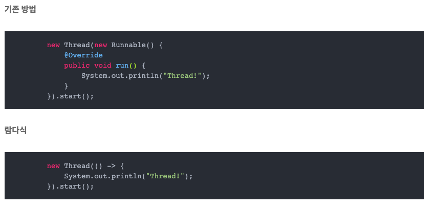

# Stream

- collection에 저장되어 있는 엘리먼트를 하나씩 순회하면서 처리할 수 잇는 코드 패턴
- 람다식을 활용
    - Lambda
        - 익명함수
        - () → {}
        
        
        
    
- 스트림 순서
    1. 스트림 인스턴스 생성
    2. 가공
        - filtering, mapping
    3. 결과
    
- 스트림 선언
    
    ```jsx
    List<String> list = Arrays.asList("a", "b", "c");
    Stream<String> stream = list.stream();
    Stream<String> parallelStream = list.parallelStream();
    ```
    
    - 병렬처리는 대규모 연산에서 성능이 향상되나 연산이 적은 상황에서 사용 되면 오히려 시간 비용 증가
        - 결과를 병합하는 리소스가 추가되기 때문

- Filtering
    
    ```jsx
    Stream<String> stream = 
      names.stream()
      .filter(name -> name.contains("a"));
    ```
    
    - 각 요소에 대해 조건식으로 필터링 가능

- Mapping
    
    ```jsx
    Stream<String> stream = 
      names.stream()
      .map(String::toUpperCase);
    ```
    
    - 각 요소를 특정값으로 변환
    - **이중콜론 - :: - 메소드 참조 표현식(method reference expression)**
        - 람다 표현식에서만 사용가능
        - [인스턴스]::[메소드]
        
        ```jsx
        List<String> names = Arrays.asList("김갑순", "김갑돌");
        
        // x를 건네고 받는 과정에서 x를 두 번 적게 된다.
        names.forEach(x -> System.out.println(x));
        
        // 아예 x들을 빼버리고 아래와 같이 작성할 수 있다.
        names.forEach(System.out::println);	
        ```
        
    
- Sorting
    
    ```jsx
    List<String> lang = 
      Arrays.asList("Java", "Scala", "Groovy", "Python", "Go", "Swift");
    
    lang.stream()
      .sorted()
      .collect(Collectors.toList());
    // [Go, Groovy, Java, Python, Scala, Swift]
    
    lang.stream()
      .sorted(Comparator.reverseOrder())
      .collect(Collectors.toList());
    ```
    
    - 기본값 오름차순, 인자를 넣어주면 내림차순
    
- Collecting
    
    ```jsx
    List<Product> productList = 
      Arrays.asList(new Product(23, "potatoes"),
                    new Product(14, "orange"),
                    new Product(13, "lemon"),
                    new Product(23, "bread"),
                    new Product(13, "sugar"));
    
    List<String> collectorCollection =
      productList.stream()
        .map(Product::getName)
        .collect(Collectors.toList());
    // [potatoes, orange, lemon, bread, sugar]
    ```
    
    - 종료 작업에 사용
    - 작업한 결과를 리스트로 변환 - .toList()