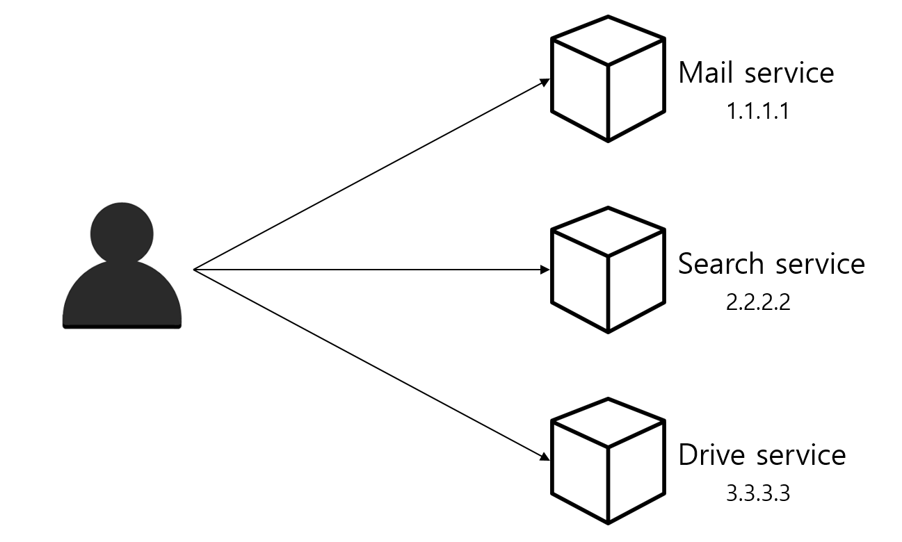

# MSA - API Gateway

- **등장배경**
    
    
    
    - 마이크로서비스를 클라이언트가 직접 호출하는 방식
        - 인증 로직을 서비스 각각 모두 구현해야함
        - api 호출을 기록하고 관리하기 어려움
        - 내부 비즈니스 로직이 드러나 보안에 취약함
    
- **API Gateway**
    
    
    
    
    - API 서버들의 엔드포인트를 단일화 해주는 또 다른 서버
    - API에 대한 인증 기능이 주요한 기능
    - 메시지 내용에 따라 마이크로서비스로 라우팅 하는 역할

- **주요 기능**
    - **인증 및 인가**
        - 인증서 관리, 인증, SSL 프로토콜 변환 등
        - 마이크로 서비스가 위 기능을 가지고 있지 않아도 됨
        - api 요청 기록 관리가 용이함
    - **요청 절차의 단순화**
        - 클라이언트 - API Gateway 만 통신하게하여 구조의 단순화
    - **라우팅 및 로드밸런싱**
        - 요청에 따라 서비스를 호출하고 부하에 따라 요청을 분산하는 로드밸런싱이 가능함
    - **서비스 디스커버리**
        - 서비스 마다 ip, port를 알고 있어야 함
        - 서비스의 위치가 동적으로 변하는 상황이 자주 발생함
        - 서비스의 위치를 찾는 것을 ‘서비스 디스커버리’ 라고함
            - 디스커버리 클라이언트가 게이트웨이로 자신의 위치를 동적으로 등록

- 참고
    - [https://velog.io/@tedigom/MSA-제대로-이해하기-3API-Gateway-nvk2kf0zbj](https://velog.io/@tedigom/MSA-%EC%A0%9C%EB%8C%80%EB%A1%9C-%EC%9D%B4%ED%95%B4%ED%95%98%EA%B8%B0-3API-Gateway-nvk2kf0zbj)