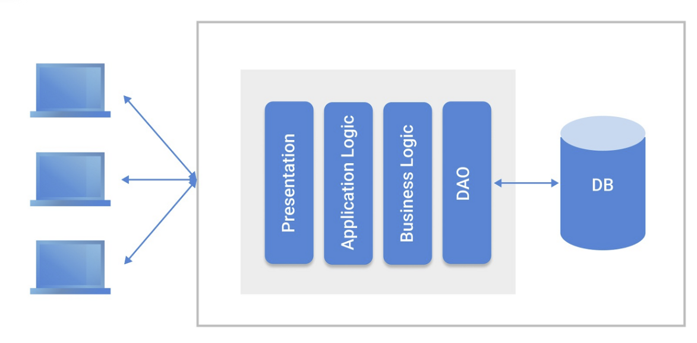

# MSA 란?

- **등장 배경**
    - 모놀리틱(Monolithic) 아키텍처
        
        
        
        - 어플리케이션의 모든 구성요소가 한 프로젝트에 통합되어 있는 형태
        - **장점**
            - 간단한 구조로 개발 편리
            - 배포, 확장 용이함
        - **단점**
            - 프로젝트가 커짐에 따라 구동, 빌드 및 배포 시간 급격히 커짐
            - 조금만 수정이 있어도 전체를 다시 빌드하고 배포해야함
            - 일부에서 장애가 발생하면 전체 서비스에 영향을 미침
            - 기술 stack이 한번 정해지면 변경하기 어려움
            - 전체적인 어플리케이션의 확장은 쉽지만 독립적인 컴포넌트를 확장하기는 어려움 (부하 분산을 위해)

- **MSA(Microservice Architecture)**
    
    
    
    - 하나의 어플리케이션을 쪼개어 독립적인 어플리케이션(**Microservice**)으로 구성하고 조합하는 형태
    - API를 통해 상호작용 가능하며 내부의 실질적인 세부사항은 전부 추상화되어 가려짐
    - **Microservice**
        - Martin Fowler
            - Miciroservice 란, 작은 규모의 단일 서비스로 스스로 작동할 수 있고 독립적으로 배포 가능한 단위의 서비스를 의미함
    - 따라서, Microservice 하나는 모놀리틱 아키텍처와 유사함
    - 각각의 서비스는 다른 서비스에 대해 의존성이 작아야함 - *독립적으로 배포 가능해야함!*
    - **장점**
        - 서비스 별 배포가 가능
        - 독립 배포가 가능하여 서비스별로 전담 개발이 가능함
        - 특정 서비스에 대해 확장이 용이함
        - 클라우드 사용에 적합
            - *이전에는 On-premise 기반의 서버 활용 - MSA 활용 어려움*
            - *클라우드 서버 활용 편리해짐에 따라 MSA 활용도 높아짐*
        - 일부분의 장애는 서비스 전체에 영향을 끼칠 가능성이 적음
    - **단점**
        - 서비스간 API 호출로 통신하기 때문에 지연 시간 증가
        - 데이터가 여러 마이크로서비스로 분산되어 통합 관리하기 어려움 - 서비스 별로 데이터를 분산하면 조회, 관리가 어려워 짐
        - 통합 테스트가 어려움

- **모놀리틱, MSA 확장성 비교**
    - **모놀리틱** - 전체 어플리케이션 확장
    
    
    
    - **MSA -** 특정 기능만 확장
    
    
    
- **트랜드**
    - [우아콘2020] 배달의민족 마이크로서비스 여행기
    
    
    
    - 서비스 장애 극복을 위해 이벤트 기반 메시징 시스템 구축
        - 각각의 어플리케이션은 다른 어플리케이션을 호출하는 것이 아니라 메시지를 발행하고 다른 어플리케이션은 메시지를 받기만 하는 형태로 서비스의 결합도를 크게 낮춤
            - ***장애 발생 현저히 낮아짐***
            - ***장애 복구 시 쌓인 메시지를 읽기만 하면 서비스 정상 구동 가능***
    - 기술 스택 정리
        
        
        

- **결론**
    - **어떤 아키텍처를 활용해야하나?**
        - 어플리케이션에 적합한 방안 채택
        - 서비스가 장애가 발생했을 경우 치명적인가?
        - 진행할 프로젝트에 마이크로서비스 아키텍처를 도입했을 때 비용을 얼마나 절감할 수 있는가?
        - 마이크로서비스 아키텍쳐를 요구할 만큼 시스템 복잡도가 높은가?
        - 클라우드 서비스 활용 유무