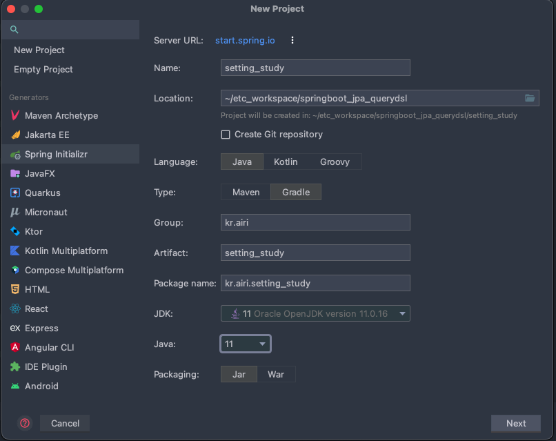

# Spring + JPA + Querydsl - 기본 세팅

- 환경
    - IntelliJ IDEA
    - Mac OS

---

1. Spring Initializr
    - 프로젝트 생성



---

- 프로젝트 dependency 추가


- application.yml 생성
    - 사용이유
        - [https://primetime.tistory.com/entry/Spring-Boot-스프링부트-applicationyml파일-설정하기-yml-VS-properties](https://primetime.tistory.com/entry/Spring-Boot-%EC%8A%A4%ED%94%84%EB%A7%81%EB%B6%80%ED%8A%B8-applicationyml%ED%8C%8C%EC%9D%BC-%EC%84%A4%EC%A0%95%ED%95%98%EA%B8%B0-yml-VS-properties)
        - 가독성, 불필요한 코드 중복 해결, 계층구조
    - 기존 properties
        
        
        
    - .yml 파일 생성
        
        
        

---

1.  로컬 DB 생성 - docker
- local-db.sh
    
    ```bash
    #!/bin/bash
    
    # base path
    DIR=$HOME/docker/shift8-test-db
    
    # create work directory
    mkdir -p $DIR/{conf,vol,init}
    
    # mariadb config
    cat <<-EOF > "$DIR/conf/my.cnf"
    #/etc/mysql/my.cnf
    #bind-address=0.0.0.0
    #
    # Optional setting
    #wsrep_slave_threads=1
    #innodb_flush_log_at_trx_commit=0
    [mysqldump]
    quick
    quote-names
    max_allowed_packet	= 16M
    [isamchk]
    key_buffer		= 16M
    [client]
    default-character-set = utf8mb4
    [mysql]
    default-character-set = utf8mb4
    #no-auto-rehash	# faster start of mysql but no tab completion
    [mysqld]
    max_connections=1500
    max_allowed_packet=256M
    character-set-client-handshake = FALSE
    character-set-server = utf8mb4
    collation-server = utf8mb4_unicode_ci
    server-id=1
    log-bin=mysql-bin
    log-slave-updates=1
    datadir=/var/lib/mysql/
    innodb_flush_log_at_trx_commit = 2
    innodb_flush_method = O_DIRECT
    skip-host-cache
    skip-name-resolve
    #
    # * IMPORTANT: Additional settings that can override those from this file!
    #   The files must end with '.cnf', otherwise they'll be ignored.
    #
    !include /etc/mysql/mariadb.cnf
    !includedir /etc/mysql/conf.d
    EOF
    
    # init script
    cat <<-EOF > "$DIR/init/user.sql"
    # allow admin local login
    ALTER USER 'root'@'localhost' IDENTIFIED BY 'root';
    # create database
    CREATE DATABASE \`airi_dev\` DEFAULT CHARACTER SET utf8mb4 COLLATE utf8mb4_unicode_ci;
    # create user
    CREATE USER 'airi_dev'@'%' IDENTIFIED BY 'developer!23$';
    # access permission setting
    GRANT ALL PRIVILEGES ON *.* TO airi_dev@'%'IDENTIFIED BY 'developer!23$';
    flush privileges;
    EOF
    
    CMD="docker run -d -p 13306:3306 --name shift8-test-db \
      -v /tmp/mysql.sock:/tmp/mysql.sock \
      -v $DIR/vol:/var/lib/mysql \
      -v $DIR/conf/my.cnf:/etc/mysql/my.cnf \
      -v $DIR/init:/docker-entrypoint-initdb.d \
      -e MARIADB_ROOT_PASSWORD=root \
      mariadb/server:latest"
    
    echo $CMD
    eval $CMD
    ```
    
- application.yml 작성
    
    ```bash
    spring:
      datasource:
        url: jdbc:mariadb://localhost:3306/airi_dev
        driver-class-name: org.mariadb.jdbc.Driver
        username: root
        password: root
      jpa:
        open-in-view: false
        generate-ddl: true
        show-sql: true
        hibernate:
          ddl-auto: create
          #ddl-auto: update
    ```
    
    - ddl-auto / 엔티티 정의대로 테이블 생성,

---