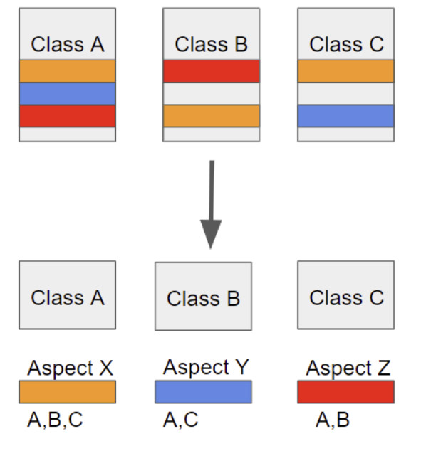

# Spring AOP

- AOP (Aspect Oriented Programming)
    - 관점 지향 프로그래밍
    - 어떤 로직을 기준으로 핵심적인 관점, 부가적인 관점으로 나눔
        - 핵심적인 관점은 비지니스 로직
    - 관점을 기준으로 모듈화 하는 것을 의미함

- Why?

- 핵심 로직을 모듈화하고 기존의 비지니스 로직에서 분리하여 재활용하기 위함
    - 접근 제어 및 핵심 로직 외 부가적인 기능이 필요한 부분에 적용
    - @AOP 어노테이션으로 Spring Bean에 등록할 수 있음
    - ***기존 코드의 변경없이 부가 기능 추가 가능함!!***

- 부가적인 기능은 어떻게?
    - 프록시 패턴 적용
    
    
    
    - 프록시 객체가 핵심 비지니스 로직을 감싸서 불필요한 반복을 줄임