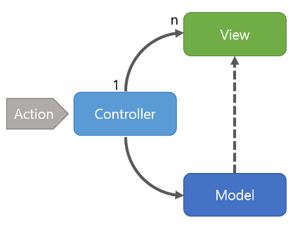
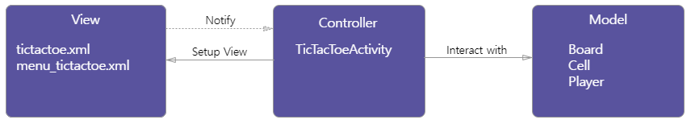
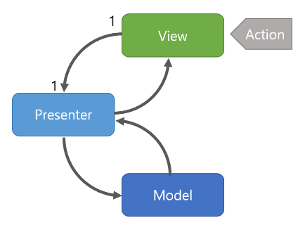
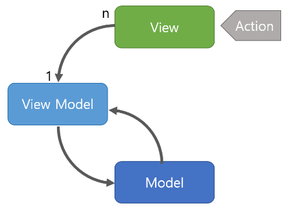
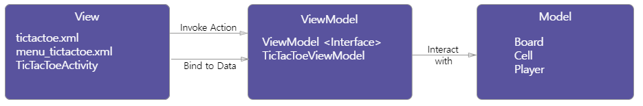

# MVC MVP MVVP

프론트개발을 하다보며 대부분 뷰를 만들고 데이터를 가공해 결합하는 일을 하게된다.

그래서 뷰와 데이터, 로직을 깔끔하게 표현하기 위해 다양한 디자인 패턴들을 적용하는데, 그 중 MVC, MVP, MVVM에 대해 순서대로 알아보고 패턴들의 특징과 패턴이 만들어진 계기에 대해 분석해보자

## MVC

Model, View, Controller로 구성된 가장 기본적인 패턴이다.
Android의 경우 xml view group, activity, data model로 구성할 수 있다.

### Model

- 데이터+상태+비지니스로직이 구현되어있다.

### View

- 데이터를 시각화하여 사용자에게 보여진다.

### Controller

- 모델과 뷰를 연결하고, 사용자의 액션을 처리하는 역할을 해준다.

안드로이드에서는 아래와 같이 구현될 수 있다.

### 동작

- 사용자의 액션이 컨트롤러에 전달된다
- 컨트롤러는 사용자의 액션에 따라 모델을 업데이트한다
- 컨트롤러는 모델을 표현할 뷰를 선택한다
- 뷰는 모델에 따라 화면을 업데이트한다

### 특징

- 컨트롤러와 뷰는 1:n 관계를 가지고있다.
- 컨트롤러는 여러개의 뷰를 가질 수 있고, 뷰는 컨트롤러를 알지 못한다

### 장

- 가장 단순한 패턴이다
- Model과 View를 분리하여 구현할 수 있다.

### 단

- Model과 View의 의존성이 높다
- 따라서 어플리케이션이 커질수록 그 복잡성이 증가한다
- 안드로이드에선 Activity에 모든 기능이 구현될 위험이 있다.
- 뷰를 변경하게 되면 의존성이 있는 Model과 Controller를 변경해야 한다.

## MVP

MVC는 모델과 컨트롤러를 분리 할 수 있어 좋은 패턴이지만 어플리케이션의 복잡성이 증가하면 의존성 연결 역시 복잡해져 유지보수와 테스트가 어려워지는 단점이있다. 그래서 뷰와 모델간 의존성을 완전히 분리한 MVP 패턴이 고안되었다.

1:1로 연결된 VP가 있고, M이 V와 분리되어 있는것을 볼 수 있다.

### View

- 사용자에게 보여지는 UI이다
- 뷰 인터페이스를 구현하여 프레젠터 의존적으로 연결된다.

### Presenter

- 모델과 뷰 사이를 연결해준다
- 프레젠터 인터페이스를 구현하여 뷰와 의존적으로 연결된다.

MV_P는 안드로이드에서 위와 같이 구현된다.
모델은 데이터와 도메인으로 구성되어 있고
프레젠터놔 뷰는 인터페이스로 1:1 연결되어있다.

인터페이스로 연결되어 있기 때문에 테스트와 재사용이 용이하다.

### 동작

- 사용자의 액션은 뷰를 통해 들어온다
- 뷰는 데이터를 프레젠터에 요청한다
- 프레젠터는 모델에 데이터를 요청한다
- 모델은 프레젠터에 데이터를 응답한다
- 프레젠터는 뷰에 데이터를 응답한다
- 뷰는 데이터를 화면에 표시한다

### 특징

- 뷰와 프레젠터는 1:1 관계이다
- 프레젠터에는 보통 ui로직과 비지니스 로직이 구현되어 있다

### 장

- 모델과 뷰간의 의존성이 없다
- 뷰오하 프레젠터가 인터페이스로 연결되어 있기 때문에 프레젠터 로직을 쉽게 테스트 할 수 있다

### 단

- 시간이 갈수록 뷰와 프레젠터간의 의존성이 강해지는 문제가 있다.
- 프레젠터에 ui로직과 비지니스 로직이 모이면서 프레젠터가 거대해지는 문제가 있다.
- 뷰와 프레젠터가 양방향으로 연결되어 있어 비지니스로직이 복잡해 질수록 로직의 파악이 어려워진다

## MVVM

M V VM로 구성되어 있는 패턴이다.
MVP에서 VP가 양방향으로, 1:1로 연결되어 있는 부분을 단방향으로 분리하여 V와 VM(P)가 n:1로 분리한 것이 특징이다.

### View

- 뷰는 뷰모델의 옵저버블 변수와 액션에 유연하게 바인딩된다.

### ViewModel

- 뷰를 표현하는 데이터와 액션이 구현되어 있다.

뷰모델과 뷰는 단방향, 그리고 1:n으로 연결되어 있다. 뷰는 뷰모델을 옵저버블하게 의존하고있지만 뷰모델은 뷰를 알필요가 없어 여러개의 뷰와 비 의존적으로 연결될 수 있다.

안드로이드에선 데이터바인딩으로 단방향 연결이 구현된다.

### 동작

- 사용자의 액션이 뷰를 통해 들어온다
- 뷰가 뷰모델로 액션을 전달한다
- 뷰모델이 액션에 모델을 요청한다
- 모델이 뷰모델에 응답한다
- 뷰모델이 데이터를 가공하여 저장한다
- **뷰가 뷰모델의 옵저저블 데이터를 참조하여 화면을 업데이트한다**

### 특징

- 데이터바인딩을 통해 뷰와 뷰모델의 데이터 흐름을 단방향으로 바꾸고, 의존성을 제거하였다
- 뷰모델과 뷰는 1:n관계이다

### 장

- 뷰모델은 여러개의 뷰를 가질 수 있다
- 각 부분이 독립적이기 때문에 모듈화 하여 개발할 수 있다

### 단

- 뷰모델의 설계가 어려워진다

# 참조

https://academy.realm.io/kr/posts/eric-maxwell-mvc-mvp-and-mvvm-on-android/

https://beomy.tistory.com/43
