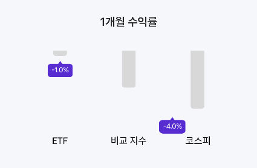
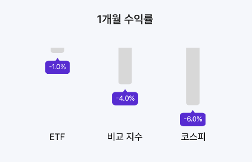

# canvas_store

- 커스텀 뷰를 만들면서 onDraw의 canvas를 사용할 일이 있었는데
- canvas로 그려지는 마커의 위치를 올바른 위치로 옮기기 위해
- translate로 원점기준 이동을 해주어야 했다.

```kotlin
    override fun draw(canvas: Canvas, posX: Float, posY: Float) {
        // translate to the correct position and draw
        canvas.translate(posX + offset.x, posY + offset.y);

        if(entity.y >= 0f){
            canvas.translate((-width/2).toFloat(), -height.toFloat());
        } else{
            canvas.translate((-width/2).toFloat(), height.toFloat()/4);
        }

        draw(canvas);
    }
```

## 문제

- 여러개의 마커가 그려지면서 translate 좌표값이 누적되어
- 마커마다 한칸 두칸씩 벗어난 위치에 그려지는 문제가 발생하였다



## 원인

- canvas는 좌표계를 이용하여 그림을 그린다
- translate는 캔버스 좌표계 자체를 움직이는 메서드이다
- 이전 onDraw때 translate로 좌표계를 이동하면 같은 canvas를 공유하는 view에선 그 좌표계가 유지된 채로 다음 그림을 그리게 된다
- 그래서 translate후 좌표계를 다시 돌려주어야 다음 그림을 그릴 때 문제가 생기지 않는다

## 해결

- canvas에는 현재 설정을 저장했다가 다시 복구하는 메서드를 제공한다
- canvas.save()를 이용해 설정을 저장하고
- canvas.restoreToCount(saveId)를 이용해 이전 설정을 복원하면 좌표계를 저장 이전 상태로 돌릴 수 있다

```kotlin
    override fun draw(canvas: Canvas, posX: Float, posY: Float) {
        var saveId = canvas.save();

        // translate to the correct position and draw
        canvas.translate(posX + offset.x, posY + offset.y);

        if(entity.y >= 0f){
            canvas.translate((-width/2).toFloat(), -height.toFloat());
        } else{
            canvas.translate((-width/2).toFloat(), height.toFloat()/4);
        }

        draw(canvas);
        canvas.restoreToCount(saveId);
    }
```


