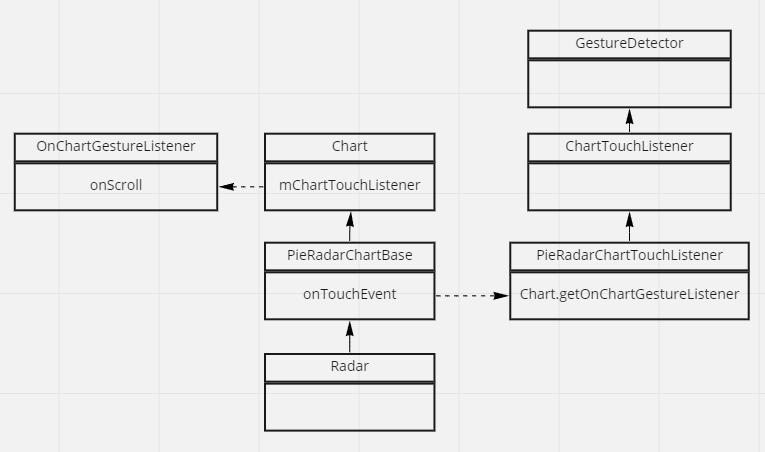

# chartLib_gesture_custom

현 앱에 사용중인 mpAndroidChart는 꽤 자유로운 커스텀을 제공하지만 간편하진 않다. 아래에 mpAndroidChart 라이브러리에서 제공하는 레이더 차트의 제스처 이벤트를 커스텀하는 과정을 기록하였다.

## 문제

radar차트는 pieRadarChartBase를 상속받고, pieRadarChartBase에서는 PieRadarChartTouchListener로 부모클래스의 터치리스너를 초기화 해준다.

그런데 이 터치 리스너에 스크롤 제스처를 구현되어 있지 않다. 문제다.

## 구조


위의 구조를 보면 3가지를 알 수 있다.

- Chart class에서는 mChartTouchListener와 mOnChartGestureListener를 가지고있다.
- 이 차트를 상속받는 PieRaderChartBase는 구현하는 차트에 맞는 리스너와 제스처 리스너를 구현한다.
- 터치 리스너에 제스처 디텍터를 구현하고, 제스처가 발생하면 Chart의 제스처 리스너를 호출한다.

전술과 같이 PieRaderChart의 기본 터치 리스너는 onScroll을 구현하지 않고, 이를 직접 등록하는 인터페이스 역시 제공하지 않는다.

## 해결

다행히 Chart 클래스에서 mChartTouchListenerd와 OnChartGestureListener에 대한 setter를 제공한다.

PieRadarChartTouchListener를 상속받는 커스텀 리스너를 생성하고 onScroll을 구현한 뒤 RadarChart 인스턴스의 리스너와 제스처디텍터를 교환하는 방식으로 해결하였다.

## 결과

### 커스텀 리스너

```kotlin
class CustomRadarChartTouchListener(chart: PieRadarChartBase<*>?) :
    PieRadarChartTouchListener(chart) {
    override fun onScroll(
        e1: MotionEvent?,
        e2: MotionEvent?,
        distanceX: Float,
        distanceY: Float
    ): Boolean {
        mLastGesture = ChartGesture.DRAG
        val l: OnChartGestureListener = mChart.getOnChartGestureListener()
        l.onChartTranslate(e1, distanceX, distanceY)
        return true
    }
}
```

### 커스텀 리스너 등록

```kotlin
setOnTouchListener(CustomRadarChartTouchListener(this))

setOnChartGestureListener(object : OnChartGestureListener{
    ooverride fun onChartTranslate(me: MotionEvent?, dX: Float, dY: Float) {
        Log.d("test", "d")
    }

})
```
