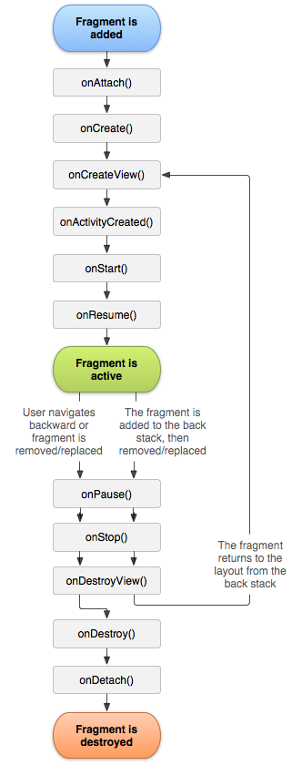

# FRAGMENT AND LIFECYCLE

- 액티비티의 모듈식 섹션
- 하나의 액티비티에 여러개의 프래그먼트 혹은
- 하나의 프래그먼트를 여러개의 액티비티에서 사용할 수 있다
- 자체적인 수명주기를 가지고 자체 입력 이벤트를 수신
- 액티비티 런타임에 추가 및 삭제가 자유로움
- 프래그먼트는 항상 액티비티 내에서 호스팅 되어야함
- 따라서 호스트 액티비티의 수명주기에 직접적으로 영향

## 프래그먼트 트랜잭션

- 액티비티 런타임에 프래그먼트를 추가 삭제 하는 등의 조작을 하는 것을 말함
- 이를 액티비티의 백스택에 추가 제거하여 관리할 수 있음
- 이 백스택의 항목이 프래그먼트 트랜잭션의 기록이라 보면 된다
- 백스택을 조작하여 사용자는 트랜잭션을 거꾸로 돌릴 수 있다.

## 디자인철학

- 프래그먼트는 11레벨부터 도입
- 태블릿과 같은 xui에 역동적이고 유연한 ui를 지원하는 것이 목적
- 프래그먼트를 사용함으로서 개발자는 뷰 계층의 복잡한 변경 내용을 관리하지 않고 복잡한 ui를 개발할 수 있게끔 해준다
- 각 프래그먼트는 모듈식이고, 재사용 가능한 구성요소로 디자인해야 한다
- 그러므로 재 사용을 염두해 두어, 하나의 프래그먼트가 다른 프래그먼트를 조작하는것은 삼가야한다
- 재사용 가능하고, 자체적인 라이프사이클을 가지고있는 프래그먼트의 특성을 살려 여러가지 화면구성에 맞는 프래그먼트 조합으로 애플리케이션을 디자인 할 수 있다.

[화면 호환성](https://developer.android.com/guide/practices/screens_support?hl=ko)

## 라이프사이클

아래에 위 라이프사이클 매서드 중 최소 요소만 정리하였다

- onCreate()

  - 프래그먼트 생성시 호출되는 매서드
  - 프래그먼트가 일시정지 되거나 중단후 재개되었을 때 유지되어야 하는 것을 초기화 해줘야 한다

- onCreateView()

  - 사용자 인터페이스를 처음으로 그릴 때 호출됨
  - 매서드에서 View를 반환해 줘야한다
  - 이 매서드가 프래그먼트 레이아웃의 루트가 된다
  - 프래그먼트가 ui를 제공하지 않으면 null을 반환하면 된다

- onPause()
  - 사용자가 프래그먼트를 떠날 때 호출
  - 일반적으로 여기서 현재 사용자의 세션을 넘어 지속되어야 하는 변경사항을 커밋(사용자가 세션 내에 돌아오지 않을 수 있으므로)

위 까지가 최소한의 구현사항이다.
