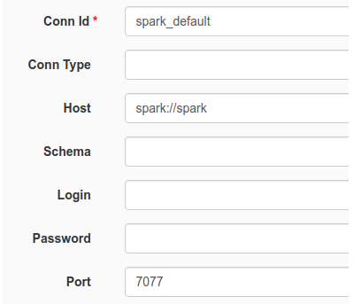

# airflow에 spark 연결
airflow에 spark provider를 설치하고 web UI에서 아래와 같이 설정해준다

- ID : 해당 연결의 고유 ID
- Conn Type : 위의 이미지에는 없지만 spark를 드롭다운 메뉴에서 선택해 주어야함.
- Host : spark://{URL or IP}를 명시
- Port : 원격 Host의 경우 맵핑되어있는 spark master의 port를 명시해 주어야함