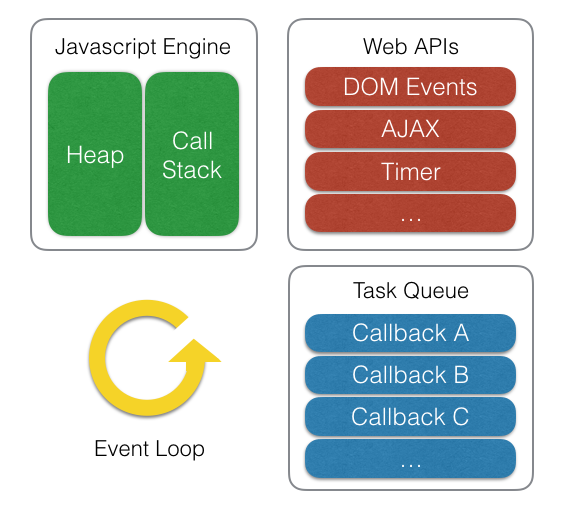
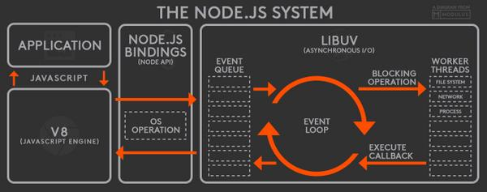

# 이벤트루프

자바스크립트의 동시성은 이벤트 루프 기반의 비동기 방식으로 구현된다.

ECMAscript는 이벤트 루프에 관한 스펙이 없다. 구체적으로 ECMA는 동시성이나 비동기에 관한 언급이 없다.(후술한 es6는 약간 다르다) 실제로 v8과 같은 자바스크립트 엔진은 단일 호출스택을 사용하여 요청이 들어올 때마다 순차적으로 호출스택에 담아 처리한다. 비동기는 자바스크립트 엔징르 구동하는 환경, 즉 브라우저나 node.js가 담당한다. 

위 그림에서와 같이 우리가 호출하는 setTimeout이나 XMLHttpRequest와 같은 비동기 함수는 자바스크립트 엔진이 아닌 WebApi 영역에 따로 정의되어 있다. 또한 이벤트 루프와 태스크 큐도 자바스크립트 엔진 외부에 구현되어 있다.

위 그림은 브라우저와 비슷한 구조를 볼 수 있는데 node.js는 비동기io를 제공하기 위해 libuv 라이브러리를 사용하며 이 라이브러리가 이벤트 루프를 제공한다. 자바스크립트 엔진은 비동기 작업을 위해 node.js의 API를 호출하며 이때 넘겨진 콜백이 libuv의 이벤트 루프를 통해 스케쥴되고 실행된다.

다음 이야기로 넘어가기 전에 한가지 확실히 해야할게 있는데 자바스크립트가 단일스레드 기반의 언어라는 말은 자바스크립트 엔진이 단일호출 스택을 사용한다 라는 관점에서만 사실이다. 실제로 자바스크립트가 구동되는 환경에서는 여러개의 스레드가 사용되며 이런 구동환경이 단일호출 스택을 사용하는 자바스크립트 엔진과 상호작용하기 위해 사용하는 개념이 바로 이벤트 루프이다.

[https://vimeo.com/96425312](https://vimeo.com/96425312)

위 링크에서 자바스크립트 비동기 처리에 대한 인터렉션 설명을 볼 수 있다.