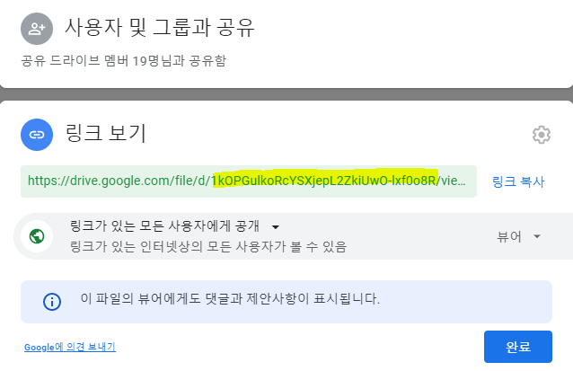

# 구글드라이브에서 파일 다운받기

1. 다운받고자 하는 파일의 링크를 생성 후 권한을 모든 사용자에게 공개로 설정
2. 위 그림에서 d/~~/view 사이 형광색으로 표시된 문자가 field인데 위의 문자열을 저장해둠
3. wget [https://raw.github.com/circulosmeos/gdown.pl/master/gdown.pl](https://raw.github.com/circulosmeos/gdown.pl/master/gdown.pl) 으로 gdown.pl 다운
4. chmod u+x [gdown.pl](http://gdown.pl/) 로 권한 부여
5. ./gdown.pl '[https://docs.google.com/uc?export=download&id=**{FIELD}**](https://docs.google.com/uc?export=download&id=%7BFILEID%7D)' **{FILENAME}** field와 filename을 채워넣어 명령 실행 (중괄호는 생략)