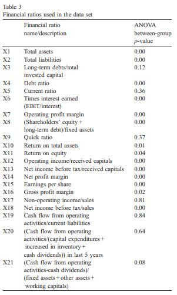

# ANOVA를 이용한 feature selecting
##### 출처 : Credit rating analysis with support vector machines and neural networks: a market comparative study (2004)
재무변수를 이용해 신용등급 레이블을 학습 시 사용된 방법론으로, 재무변수를 셀렉팅하는 방법에 대한 내용이다.
1. 재무변수를 선정한다
2. 실제 신용등급이 산정되기 1~2분기가 소요되므로 특정 분기의 2분기 전의 변수로 특정분기의 신용등급을 예측하는 형식으로 학습을 진행시킨다
3. 재무변수가 광범위 하므로 분산분석(ANOVA)를 사용하여 특정 재무변수가 신용등급의 변화에 유의한지 스코어링한다.
4. 차이가 유의하지 않는 경우 등급결정에 기여하지 않는 것으로 간주하고 배제한다.

## ANOVA 적용 결과
ANOVA 적용 결과 테이블
 
위 테이블에서 ANOVA 결과인 p-value를 살펴보면 3, 5, 9, 17, 19, 20 변수의 값이 높은 것을 볼 수 있는데, 이는 해당변수가 신용등급 변화에 기여하지 않는다는 것이다. 
이런식으로 간단하게 넓은 특징공간을 축소 시켜 학습시간과 결과를 향상시킬 수 있으나 단일 변수를 대상으로 분석하였기 때문에 복합 변수에서의 영향은 분석하기 어렵다.