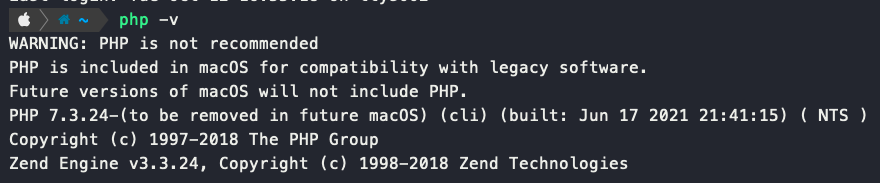
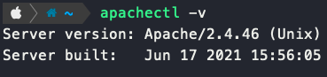
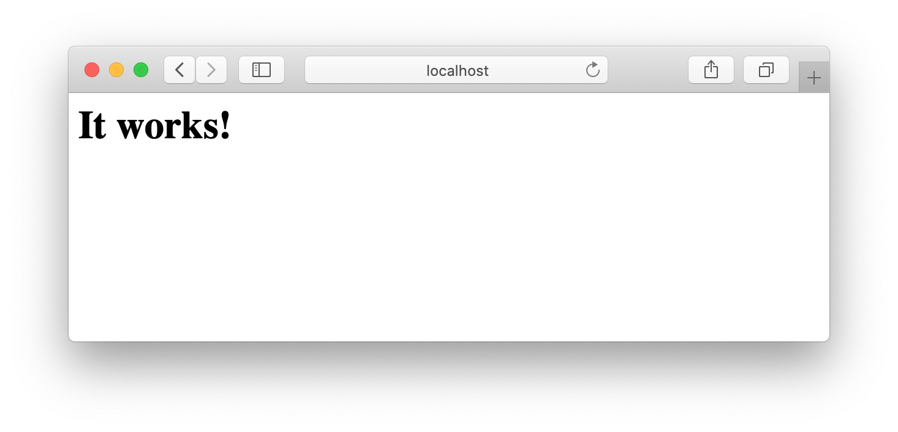
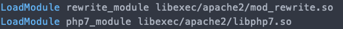
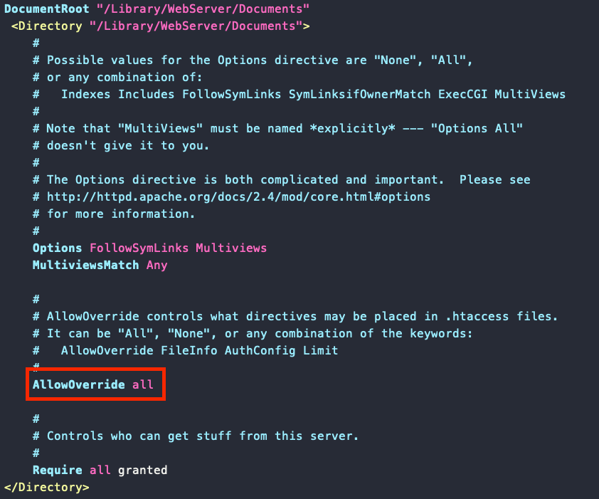
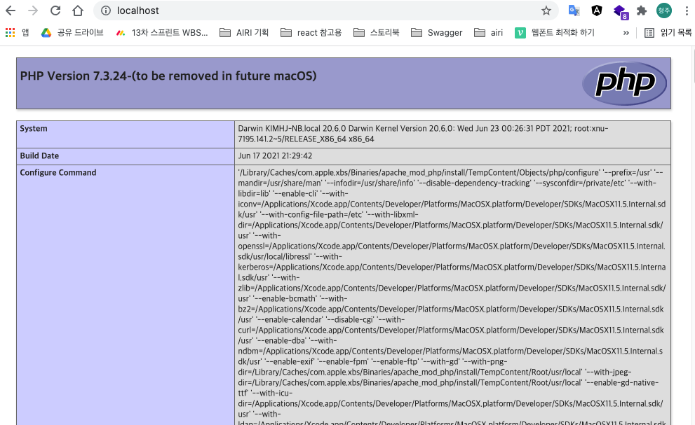

# Mac에서 Apache Setting

맥에는 기본적으로 PHP와 Apache가 깔려있으므로 굳이 추가 설치가 필요하진 않음  
하위 버전이 필요한 경우에 한해서 별도 설치 필요

## PHP 버전 확인

```shell
$ php -v
```



## Apache 버전 확인

```shell
$ apachectl -v
```



## Apache 실행

```shell
sudo apachectl start
```

브라우저에서 localhost를 접속하면 아래와 같은 화면이 보인다.



## Apache 설정

Apache의 설정파일은 `httpd.conf` 라고 불리며 다음 경로에 위치한다.

```shell
$ sudo vi /etc/apache2/httpd.conf
```

### 설정 변경

아래와 같은 기본 내용을 `httpd.conf` 파일을 수정해 적용한다.

1. PHP 사용
2. .htaccess Override 적용



`mod_rewrite.so` 는 `.htaccess`를 오버라이드 해서 사용할 수 있도록 도와준다

`libphp7.so`는 PHP 7 버전을 apache가 사용할 수 있도록 도와준다

이어서 `DocumentRoot`에서 `.htaccess` 를 오버라이드 할 수 있도록 옵션을 수정한다.

`httpd.conf`에서 `<Directory "/Library/WebServer/Documents">` 를 찾은 뒤 해당 태그 안에 있는 `AllowOverride None`을 `AllowOverride all`로 변경해준다.




## 테스트

Apache의 `DocumentRoot`인 `/Library/WebServer/Documents`에서 `index.php` 파일을 만들고 아래와 같은 내용을 입력하고 저장한다.

```php
<?php
  phpinfo()
?>
```

이후 브라우저를 통해 localhost에 접속하면 다음과 같은 화면을 볼 수 있다.




이후 `/Library/WebServer/Documents` 내에 php 프로젝트를 세팅하면 된다.
