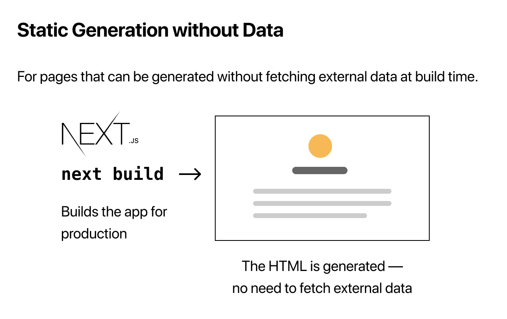

# Next.js SSG & SSR

## SSG

`Static Site Generating` 정적 사이트 생성

빌드단계에서 Static Site를 만들어 실제 요청에 사용할 수 있는 HTML 파일을 output으로 낸다.

SSG는 데이터 사용유무에 따라 처리하는 방식이 다르다

### Without Data

빌드시 바로 HTML을 생성한다.  
외부 데이터를 fetch 할 필요가 없으니 추가 작업이 필요하지 않음

### With Data

빌드단계에서 외부 데이터를 fetch해 온다.  
이때 해당 Page Component가 사용할 수 있도록 상황에 따라 `getStaticProps()` 또는 `getStaticPaths()` 함수를 만들어준다.

`getStaticProps()` 는 페이지에 동적 데이터를 추가해준다.  
query, path param 등 외부의 params를 먼저 읽어 데이터 fetch를 통해 페이지를 생성해준다.

## SSR

`Server Side Rendering` 서버사이드 렌더링

빌드와 상관없이 매 요청마다 데이터를 fetch한다. 이때 사용되는 함수는 `getServerSideProps()`

Next.js 에서는 SSR보다 SSG를 권장한다. 

----

SSG건 SSR이건 데이터를 반드시 pre-fetching 해야 하는 케이스가 무엇이 있을지 생각해볼 필요성이 있다.

Next.js 에서도 페이지의 업데이트가 자주 되는 경우 pre-rendering 대신 CSR을 권장하고 있다.  
성능상의 장점, SEO 등 여러 이유로 SSG, SSR 등이 사용되고 있지만 필요에 따라 취사선택 하는게 가장 베스트지 싶다.
