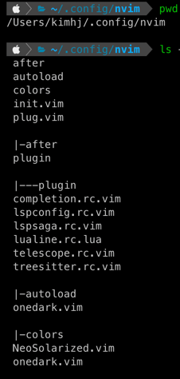

# Neovim 개발환경 구축

## inspiration

https://www.youtube.com/watch?v=FW2X1CXrU1w

## neovim ?

현재에는 수십년간 개발된 Vim의 커다란 코드베이스에 새로운 기능과 버그수정을 병합하는게 매우 어려움.  

때문에 기존 Vim 코드를 리팩토링하는 프로젝트로 neovim이 탄생

## Ingredients

* vim-plug
  * Vim 플러그인 매니저
* nvim-lspconfig
  * LSP(Language Server Protocol) 설정 플러그인
* nvim-treesitter
  * Treesitter 설정 플러그인
* completion-nvim
  * LSP 기반의 자동완성 플러그인
* lspsaga.nvim
  * LSP 유저 인터페이스 플러그인
* telescope.nvim
  * Fuzzy Finder 플러그인
* lualine.nvim
  * Lua로 작성된 statusline 플러그인

## Install

> mac 환경을 기반으로 설명하며 homebrew가 깔려있음을 전제한다.  
> ./nvim/config 내에 있는 파일을 복사해 적용한다.

### 1. 최신버전 brew로 업데이트

```shell
$ brew update
```

### 2. neovim install

```shell
$ brew install --HEAD tree-sitter luajit neovim

# 설치 확인
$ which nvim  # default 설치시 /usr/local/bin/nvim 이 나와야 함
$ nvim --version # 작성일(21.09.01) 기준 v0.6.0

# local bin에 vim으로 심볼릭 링크 세팅 (zsh 기준)
$ ln -s $(which nvim) /usr/local/bin/vim

# 심볼릭이 제대로 걸렸는지 확인
$ ls -al /usr/local/bin | grep vim
lrwxr-xr-x  1 kimhj  admin  38  9  1 15:33 nvim -> ../Cellar/neovim/HEAD-284199b/bin/nvim
lrwxr-xr-x  1 kimhj  admin  19  9  1 15:44 vim -> /usr/local/bin/nvim  # <-- 이부분이 신규 추가!

# which vim
# which 로 /usr/local/bin/vim이 정상적으로 나오지 않으면 terminal 재시작
/usr/local/bin/vim  
```

### 3. plugin 설치

> plug.vim

#### install
``` shell
sh -c 'curl -fLo "${XDG_DATA_HOME:-$HOME/.local/share}"/nvim/site/autoload/plug.vim --create-dirs \
       https://raw.githubusercontent.com/junegunn/vim-plug/master/plug.vim'
```

#### 사전 준비
```shell
# config
$ cd ~/.config
$ mkdir nvim
$ cd nvim
$ mkdir after colors autoload
```

#### 테마 적용
```shell
# config/colors/onedark.vim 파일 내용 복사 이후
$ cd colors # ~/.config/nvim/colors
$ vim onedark.vim # 취향에 맞게 theme는 알아서..
:set paste
command + v

# config/autoload/onedark.vim 파일 내용 복사 이후
$ cd autoload  # ~/.config/nvim/autoload
$ vim onedark.vim
:set paste
command + v
```

#### neovim init
```shell
# config/init.vim 파일 복사 이후
# ~/.config/nvim
$ vim init.vim # 기타 테마 변경시 135~137 라인 참고
:set paste
command + v
```

#### install other plugins

```shell
# config/plug.vim 파일 복사 이후
# ~/.config/nvim
$ vim plug.vim
:PlugInstall
```

```shell
# LSP for typescript
# ~/.config/nvim

$ npm i -g typescript typescript-language-server
$ mkdir -p after/plugin
$ vim ./after/plugin/lspconfig.rc.vim
# 파일 복붙
```

```shell
# lspsaga.nvim
$ vim ./after/plugin/lspsaga.rc.vim
# 파일 복붙
:PlugInstall
```

```shell
# nvim-treesitter
$ vim ./plug.vim
# 파일 복붙
:PlugInstall
:TSInstall javascript

$ vim ./after/plugin/treesitter.rc.vim
# 파일 복붙
```

```shell
# completion-nvim # 자동완성
$ vim ./plug.vim
# 파일 복붙

$ vim ./after/plugin/lspconfig.rc.vim
# 파일 복붙

$ vim ./after/plugin/completion.rc.vim
# 파일 복붙
:PlugInstall
```

```shell
# completion Icons
$ vim ./after/plugin/lspconfig.rc.vim
# 파일 복붙
```

```shell
# telescope.nvim
$ vim ./plug.vim
# 파일 복붙

$ vim ./after/plugin/telescope.rc.vim
# 파일 복붙

# live_grep이 잘 안된다면 brew install ripgrep
```

```shell
# use Custom File Icon
$ vim ./plug.vim
# 파일 복붙
:PlugInstall
```

```shell
# lualine.nvim
$ vim ./plug.vim
# 파일 복붙
:PlugInstall

$ vim ./after/plugin/lualine.rc.lua
# 파일 복붙
```


### 최종 config 파일 목록


