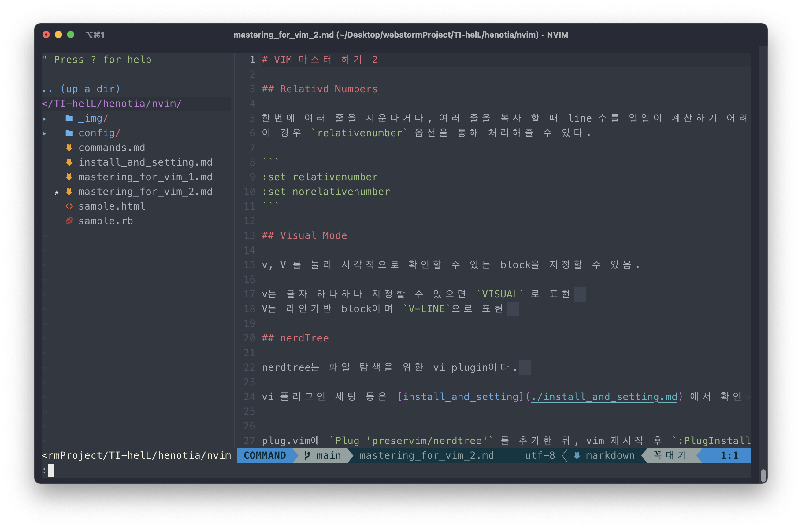

# VIM 마스터 하기 2

## Relative Numbers

한번에 여러 줄을 지운다거나, 여러 줄을 복사 할 때 line 수를 일일이 계산하기 어려울 경우가 더러 있다.  
이 경우 `relativenumber` 옵션을 통해 처리해줄 수 있다.

```
:set relativenumber
:set norelativenumber
```

## Visual Mode

v, V 를 눌러 시각적으로 확인할 수 있는 block을 지정할 수 있음.

v는 글자 하나하나 지정할 수 있으면 `VISUAL` 로 표현  
V는 라인기반 block이며 `V-LINE`으로 표현  

## Nerd Tree



nerdtree는 파일 탐색을 위한 vi plugin이다.  

vi 플러그인 세팅 등은 [install_and_setting](./install_and_setting.md) 에서 확인할 수 있으며 `vim-plug`가 깔려있다고 전제한다.


plug.vim에 `Plug 'preservim/nerdtree'` 를 추가한 뒤, vim 재시작 후 `:PlugInstall`로 설치해준다.

### 추가 설치 플러그인

nerdTree는 다양한 플러그인을 제공해주며 기능적으로 더 완벽해 질 수 있다.  
`plug.vim` 아래에 아래와 같은 내용을 작성한다.

```vim
  Plug 'scrooloose/nerdtree' " NerdTree 플러그인
  Plug 'Xuyuanp/nerdtree-git-plugin' " NerdTree 에서 git status 확인 
  Plug 'ryanoasis/vim-devicons'   " NerdTree Icon
  Plug 'tiagofumo/vim-nerdtree-syntax-highlight'  " NerdTree 구문강조
```

이후 plugin 설정을 다음과 같이 해준다.  
plugin 설정은 `init.vim` 하단에 작성해도 좋고 `after/` 디렉토리 아래에 임의로 만들어도 좋다.  
`after/plugin/nerdtree.rc.vim` 이라는 이름으로 파일을 만들고 아래의 내용을 입력한다

```
" VIM이 파일 없이 켜질 경우 NerdTree 실행
autocmd StdinReadPre * let s:std_in=1
autocmd VimEnter * if argc() == 0 && !exists('s:std_in') | NERDTree | endif

" VIM 실행시 파일이 존재하면 해당 윈도우로 커서 이동
autocmd StdinReadPre * let s:std_in=1
autocmd VimEnter * NERDTree | if argc() > 0 || exists("s:std_in") | wincmd p | endif


" NerdTree가 유일한 창일 경우 VIM 종료
autocmd BufEnter * if tabpagenr('$') == 1 && winnr('$') == 1 && exists('b:NERDTree') && b:NERDTree.isTabTree() | quit | endif
```

### 사용 방법

> 기본적으로 nerdTree는 split된 vi 화면과 동일하게 생각하면 된다.

nerdTree를 토글하는 방법으로는 `:NerdTreeToggle` 명령어를 사용하면 된다.  
nerdTree 내부에서는 일반 vi처럼 사용 가능하고, ? 를 타이핑 하면 도움말이 나오니 보고 참고할것

