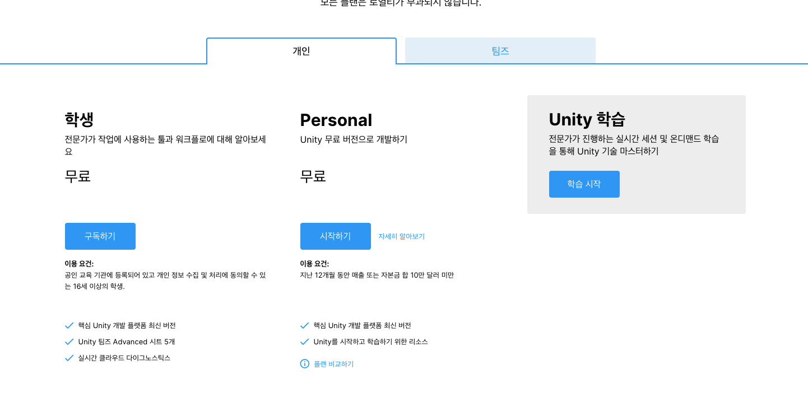
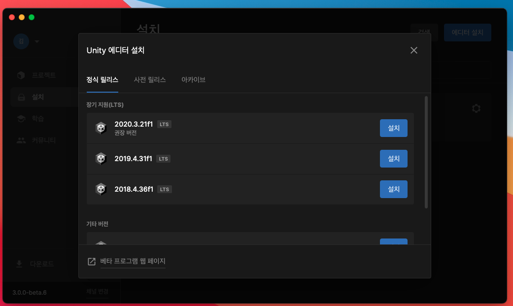
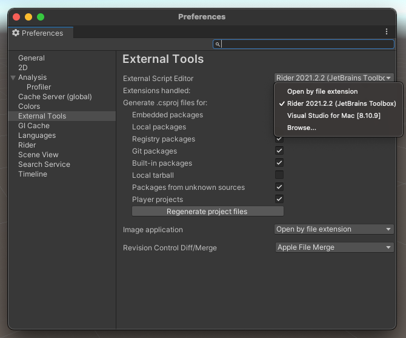

# Unity 1일차

## 유니티 환경 세팅

[유니티사이트](https://unity.com/kr/solutions/gaming-services) 에서 회원가입을 한 뒤 플랜을 설정한다  
혼자 사용할테니 Personal로 해주면 된다

이후 [UnityHub](https://unity.com/download?_ga=2.202354001.1124891199.1635245694-97471287.1635245694) 를 다운받는다

## Unity Hub

위의 설치파일을 통해 Unity Hub를 설치하면 Unity Editor를 설치해주면 된다.

권장 버전이 적혀있으므로 해당 버전을 설치한다

## Rider 설치

나는 Jetbrains 기반 개발툴을 사용하므로 Unity Editor로 Rider를 이용하기로 함

Unity Editor 설치 이후 Rider를 설치하고 아무 유니티 프로젝트를 생성해 들어간 뒤 에디터 환경설정에서 스크립트 에디터를 바꿔준다

