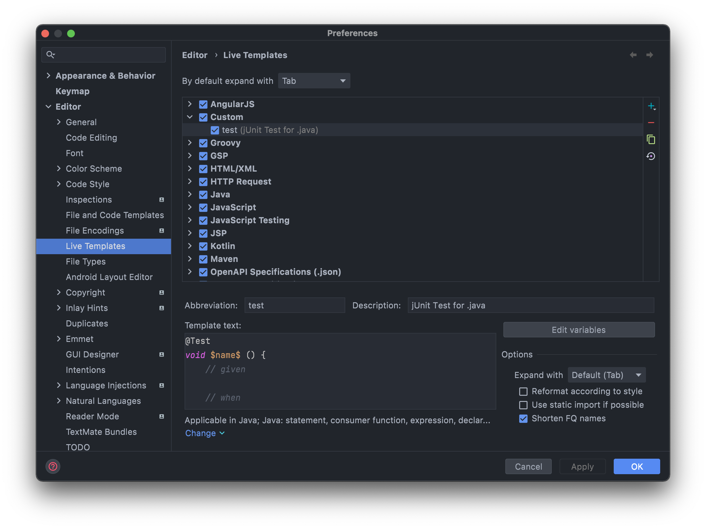

# IntelliJ Live Template

## Create Template

Preference > Editor > Live Templates

- `Custom` 그룹 생성 후 실제 코드 작성시 사용할 Live Template을 정의하면 관리하기 용이하다.



```java
@Test
void $name$ () {
    // given

    // when

    // then

}
```
