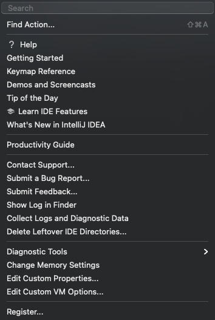
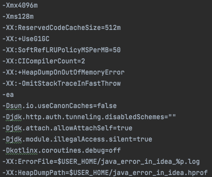

# [IntelliJ] Memory Setting

## 1. Help > Edit Custom VM Options...

## 2. Modify Xms, Xmx Value

## 3. Restart IntelliJ

## ✅ Reference

- goddaehee, [**[IntelliJ] IntelliJ 메모리 설정(IntelliJ 메모리 늘리기)**](https://goddaehee.tistory.com/246), 2020.04
