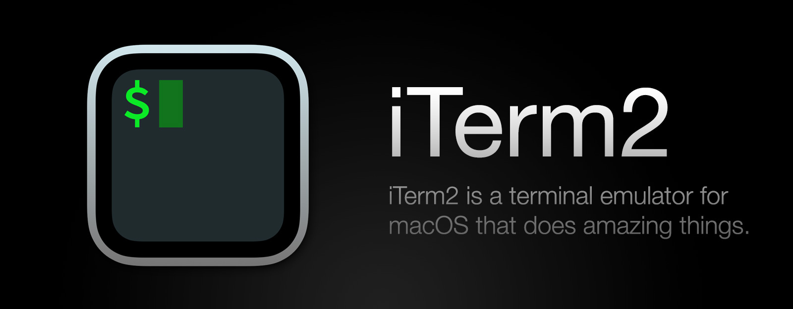
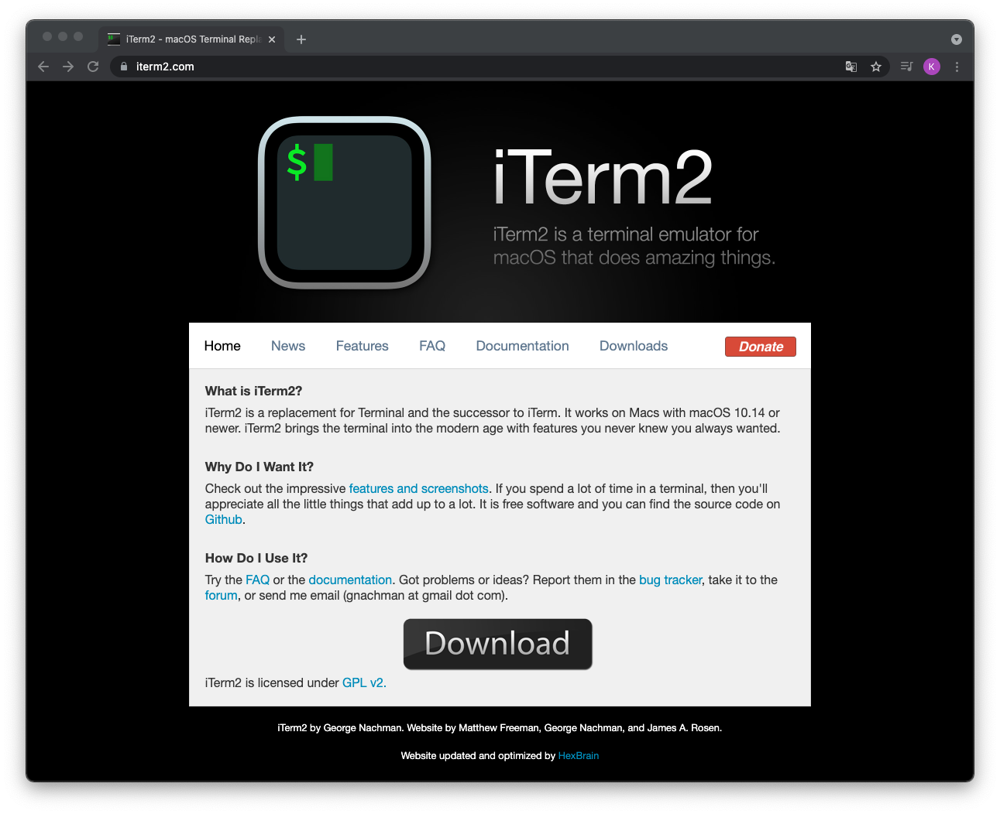
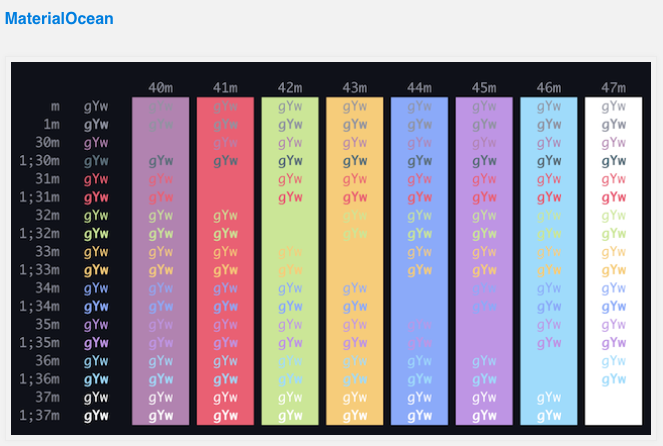
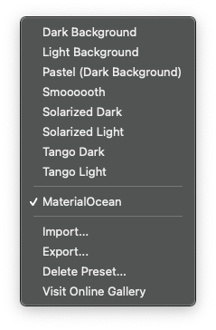
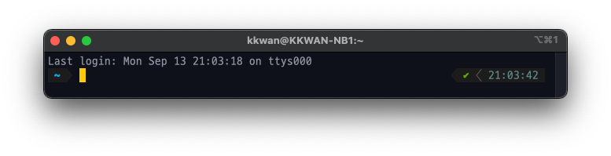
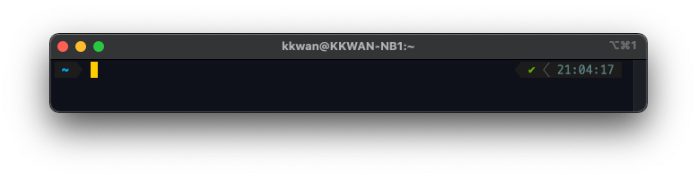

# [개발 환경] iTerm2 Customization

## 🙋‍♂️ What is iTerm2?

[](https://iterm2.com/)

iTerm2는 macOS에서 기본적으로 제공하는 터미널을 대체 할 수 있는 가상 터미널 어플리케이션이다. George Nachman의 주도로 개발되고 있으며 작성일 기준(2021.09.13) 최신 버전은 `3.4.9`이다.

iTerm2는 오픈소스 프로젝트로, GPL v2 라이센스가 적용되어 있다. GitHub를 기반으로 소스코드를 관리하고 있으며, Issue Tracking System으로는 Gitlab을 사용하고 있다.

iTerm2는 macOS에서 기본적으로 제공되는 터미널보다 다양한 기능을 제공하고 있다. 공식 홈페이지 내 [Features](https://iterm2.com/features.html)를 참고하면 다음과 같은 기능들을 제공한다. 각 기능들에 대한 상세 설명은 추후 업데이트 예정이다.

[**(참고할 URL)**](https://medium.com/harrythegreat/%EC%95%8C%EC%95%84%EB%91%90%EB%A9%B4-%EB%8F%84%EC%9B%80%EB%90%98%EB%8A%94-iterm2-%EA%B3%A0%EA%B8%89%EA%B8%B0%EB%8A%A5-81a4cd81bab7)

- Split Panes
- Hotkey Window
- Search
- Autocomplete
- Copy Mode
- Paste History
- Instant Replay
- Configurability
- Unixyness
- 24-bit Color
- Readability
- Mouse Reporting
- Notification Center Support
- Global Search
- Tagged Profiles
- Multi-Lingual
- Triggers
- Smart Selection
- Shell Integration
- Automatic Profile Switching
- Inline Images
- Timestamps
- Password Manager
- Advanced Paste
- Annotations
- Badges
- Captured Output

## 🤷‍♂️ How to install?

iTerm2의 설치 방법은 다음과 같이 두가지가 존재한다.

1. [**공식 홈페이지**](https://iterm2.com/)를 통한 다운로드

   [](https://iterm2.com/)

2. **Homebrew**를 통한 다운로드

   ```sh
   brew install --cask iterm2
   ```

## ⚙️ iTerm2 Customization

### 1. zsh and oh-my-zsh Install

Catalina 이후의 macOS는 기본 쉘로 zsh를 채택하여 제공하고 있지만, 최신 버전 적용 및 초기 설치를 진행하는 사용자를 위해 다음 명령어를 실행한다.

```sh
brew update
brew install zsh
chsh -s $(which zsh)
```

정상적으로 zsh의 설치 및 업데이트를 마친 후, 다음 명령어를 통해 [**oh-my-zsh**](https://ohmyz.sh/)를 설치한다.

```sh
sh -c "$(curl -fsSL https://raw.github.com/ohmyzsh/ohmyzsh/master/tools/install.sh)"
```

### 2. zsh Theme

원하는 theme가 있을 경우 혹은 [**ohmyzsh themes**](https://github.com/ohmyzsh/ohmyzsh/wiki/Themes)에서 마음에 드는 theme를 찾은 후, 해당되는 theme 이름을 `~/.zshrc`에 정의하면 정상적으로 theme가 적용되는 것을 확인 할 수 있다.

zsh의 경우 매우 다양한 종류의 theme를 제공해주는데, 다양한 zsh theme를 경험해보고 적용하고자 하면 `random` theme를 통해 iTerm2f를 실행할 때 마다 theme를 변경할 수 있다.

```sh
# ~/.zshrc
...
ZSH_THEME="[zsh theme]"
...
```

"[**본격 macOS에 개발 환경 구축하기**](https://subicura.com/2017/11/22/mac-os-development-environment-setup.html)"에 따르면 zsh의 대표적인 theme로 powerlevel0k, spaceship, pure가 있지만 속도와 기능 측면에서 powerlevel10k가 좋다고 한다.

#### 2.1 powerlevel10k

#### powerlevel10k Install

```sh
git clone --depth=1 https://github.com/romkatv/powerlevel10k.git ${ZSH_CUSTOM:-~/.oh-my-zsh/custom}/themes/powerlevel10k
```

#### powerlevel10k Apply

정상적으로 설치가 완료되었다면, `~/.zshrc`를 다음과 같이 업데이트한다.

```sh
# ~/.zshrc
...
ZSH_THEME="powerlevel10k/powerlevel10k"
...
```

#### powerlevel10k config update

`~/.zshrc` 업데이트 후 새로운 탭을 열면 대화형 설정창이 뜨고 상세하게 테마를 설정할 수 있다. 설정한 테마를 변경하고자 할 땐 `p10k configure`를 통해 재설정할 수 있다.

### 3. Font Install

#### 3.1 MesloLGS NF (powerlevel10k default)

> powerlevel10k theme에서 기본적으로 제공하는 폰트로 [**powerlevel10k Github**](https://github.com/romkatv/powerlevel10k/#user-content-fonts)에서 다운로드 가능하다.

#### 3.2 D2 coding Font

> 네이버에서 제공하는 폰트로 나눔바른고딕을 바탕으로 개발자의 코딩을 위해 가독성 및 유사 문자간 변별력 뿐만 아니라 디자인적으로 한글과의 조화를 고려해 최적화시킨 글꼴이다. [**d2coding Github**](https://github.com/naver/d2codingfont)에서 다운로드 가능하다.

### 4. Color Presets

#### 4.1 Use Default Presets

`Preferences > Colors > Color Presets ...` 를 통해 기본적으로 제공하는 Color Preset을 적용하거나, 일부 색상만을 변경하여 적용한다.

#### 4.2 Use Share Presets

`Preferences > Colors > Color Presets ...` 내 Visit Online Gallery를 통해 공유된 Color Presets을 이용하거나, [**iterm2colorschemes**](https://iterm2colorschemes.com/)에서 원하는 Color Preset을 찾고, 적용할 수 있다.

iterm2colorschemes을 이용할 경우 원하는 Color Preset을 찾은 후, Color Preset 이름을 우클릭하여 `다른 이름으로 링크 저장 ...`을 클릭하고, `.itermcolors` 확장자를 붙여 저장한다. 정상적으로 저장됐음을 확인하고, `Preferences > Colors > Color Presets ... > import`를 통해 저장한 Color Preset을 적용한다.

> 예시로, MaterialOcean이라는 Color Preset을 적용하고자 할 때, Color Preset 이름을 우클릭하여 `다른 이름으로 링크 저장 ...`을 클릭하고, 파일이름을 `MaterialOcean.itermcolors`로 저장한다.



<p align="center"></p>

### 5. SIB(Simple is Best) Style

#### 5.1 Remove Last Login Information

터미널 실행 시 상단에 출력되는 `Last login` 정보를 다음 방법을 통해 삭제할 수 있다.

```sh
cd ~
touch .hushlogin
```




## 🍯 Tips

### 1. Plugins

- zsh-autosuggestions
- zsh-syntax-highlighter
- autojump

#### 1.1 Plugins Install

```sh
# zsh-autosuggestions
git clone https://github.com/zsh-users/zsh-autosuggestions ${ZSH_CUSTOM:-~/.oh-my-zsh/custom}/plugins/zsh-autosuggestions

# zsh-syntax-highlighter
git clone https://github.com/zsh-users/zsh-syntax-highlighting.git ${ZSH_CUSTOM:-~/.oh-my-zsh/custom}/plugins/zsh-syntax-highlighting

# autojump
brew install autojump
```

#### 1.2 Plugins Apply

`vi ~/.zshrc` 또는 `code ~/.zshrc` 명령을 통해 zsh 환경설정 파일을 열고, plugins 항목에 플러그인을 추가한다.

```sh
plugins=(
	...
	zsh-autosuggestion
	zsh-syntax-highlighting
	autojump
)
```

#### 1.3 Shell Restart

```sh
exec $SHELL
```

### 2. Shortcuts

|          Function          |         Shortcut         |
| :------------------------: | :----------------------: |
|         새 창 열기         |        `cmd + n`         |
|         새 탭 열기         |        `cmd + t`         |
|      창 또는 탭 닫기       |        `cmd + w`         |
|   전체 화면 전환 및 취소   |      `cmd + enter`       |
|        탭 순차 이동        |       `ctrl + tab`       |
|        탭 지정 이동        |    `cmd + [탭 번호]`     |
|        탭 방향 이동        |     `cmd + [방향키]`     |
|        창 세로 분할        |         `cmd +d`         |
|        창 가로 분할        |    `cmd + shift + d`     |
| 분할 창 포커스 오른쪽 이동 |        `cmd + ]`         |
|  분할 창 포커스 왼쪽 이동  |        `cmd + [`         |
|        포커스 찾기         |        `cmd + /`         |
|  클립보드 복사 내용 확인   |    `cmd + shift + h`     |
|       환경설정 열기        |        `cmd + i`         |
|   여러 창 동시 입력 모드   |    `cmd + shift + i`     |
|     단일 창 입력 모드      | `cmd + shift + ctrl + i` |
|            종료            |        `cmd + q`         |

## ✅ Reference

- [**iTerm2 Official**](https://iterm2.com)
- [**powerlevel10k Github**](https://github.com/romkatv/powerlevel10k)
- [**d2coding Github**](https://github.com/naver/d2codingfont)
- Daegwon Nacyot Kim, [**iTerm2란? 맥OS의 터미널 대체 애플리케이션**](https://www.44bits.io/ko/keyword/iterm2), 2021.03
- subicura, [**본격 macOS에 개발 환경 구축하기**](https://subicura.com/2017/11/22/mac-os-development-environment-setup.html), 2021.09
- mook9288, [**[Mac] iTerm2 설치 및 테마**](https://velog.io/@mook9288/macRecord-005), 2021.01
- ruddms936, [**zsh 플러그인 설치**](https://velog.io/@ruddms936/zsh-%ED%94%8C%EB%9F%AC%EA%B7%B8%EC%9D%B8-%EC%84%A4%EC%B9%98), 2020.10
- hmjko, [**iTerm2 단축키 정리**](https://hmjkor.tistory.com/484), 2018.08
