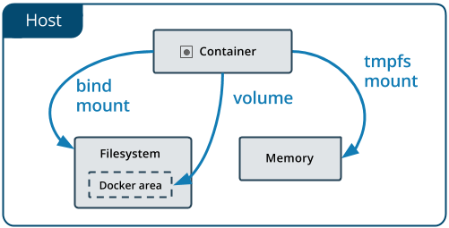

# 도커 컨테이너 마운트 유형

> 컨테이너를 운영하면서 발생한 데이터들은 기본적으로 컨테이너 삭제와 함께 데이터도 함께 지워진다. **Docker**는 데이터 보존을 위해 두가지 방법을 제공한다.

## Volume

볼륨은 도커 컨테이너에서 생산되고 사용되는 데이터를 영구적으로 저장하기 위한 방법이다. 바인드 마운트가 호스트 머신의 디렉토리 구조나 OS에 의존적인 반면, 볼륨은 도커에 의해 완전히 관리된다. 볼륨은 바인드 마운트에 비해 다음의 장점을 가진다.

- 바인드 마운트보다 백업하거나 마이그레이트 하기 휩다
- Docker CLI 커맨드나 Docker API를 활용해 관리할 수 있다.
- 리눅스, 윈도우 컨테이너 모두에서 작동한다.
- 여러 컨테이너 간 공유할 때 더 안전하다.
- 볼륨 드라이버는 리모트 호스트나 클라우드 공급사에 볼륨을 하거나, 내용을 해독, 다른 기능을 더할 수 있도록 한다.
- 새로운 볼륨은 컨테이너에 의해 이미 생성된 컨텐트를 가질 수 있다.
- Docker Desktop의 볼륨은 백, 윈도우 호스트의 바인드 마운트보다 성능이 높다.

## Bind Mount

볼륨에 비해서 기능이 제한되어있다. 바인드 마운트를 사용하면 host의 파일과 디렉토리가 컨테이너에 마운트된다. 파일 또는 디렉터리는 호스트 머신의 절대 경로로 참조된다. 반대로 볼륨을 사용하면 호스트 머신 상의 도커의 스토리지 디렉토리에 새로운 디렉토리가 생성된다. 그리고 도커가 해당 디렉토리의 컨텐츠를 관리한다.

파일 또는 디렉토리는 도커 호스트에 미리 존재하고 있을 필요는 없다. 만약 존재하지 않는다면 온디맨드로 생성된다. 바인드 마운트는 성능이 좋지만, 호스트 머신의 파일 시스템에 의존적이며 특정 디렉토리 구조를 필요로 한다.바인드 마운트를 직접적으로 관리하기 위해 Docker CLI 커맨드를 사용할 수 없다.
