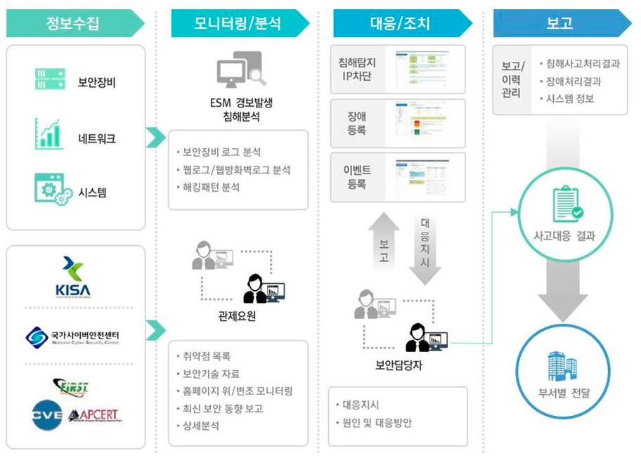

# 보안관제

**"사이버 공격을 탐지, 분석, 대응하는 일련의 활동"**

## 보안관제의 정의

기업의 정보, 기술과 같은 중요 자산을 해킹, 바이러스 등의 사이버 공격으로부터 보호하기 위한 일련의 활동이다. 기본적으로 보안관제는 **기업의 각종 보안 이벤트 및 시스템 로그 등을 관제 센터에서 실시간으로 모니터링하고, 분석하여 사이버 공격을 예방 및 대응**한다.

## 보안관제의 필요성

- 보안사고 예방을 통한 안전한 서비스 제공
- 정보보호 및 개인정보 법 제도 준수
- 업무수행 강화를 통한 조직의 IT 정보자산 보호
- 악성코드 실시간 탐지 및 대응체계 구축

## 보안관제 구성 요소

1. **전송 - 에이전트**

   에이전트는 각종 보안 장비 및 서버, 네트워크에 설치되어 해당 시스템에 적합한 설정에 따라 로그 정보를 실시간으로 관제센터에 전송한다.

1. **저장 - 정보수집 서버**

   정보수집 서버는 각 에이전트에서 보낸 다량의 정보를 수집 및 처리하여 데이터베이스에 저장하는 역할을 수행한다. 이때 에이전트에 대한 확인 작업을 통해 모니터링 과정 및 분석과정에 요구되는 각종 리포팅 소스를 제공한다.

1. **분석 - 통합관제용 시스템**

   통합관제용 시스템은 각종 이벤트 로그 분석을 수행한다.

## 보안관제 유형

> **On-premise**

- **원격 관제**

  - 보안관제 시스템을 직접 구축하고, 관제 업체로부터 침입차단 시스템 등 주요 보안장비 중심의 보안 이벤트에 대해 상시 모니터링 서비스를 제공받는 관제 형태

- **파견관제**

  - 보안관제 시스템을 직접 구축하고, 관제 전문 인력을 관제 업체로부터 파견받아 보안관제 업무를 수행하는 관제 형태

- **자체관제**
  - 보안관제 시스템을 직접 구축하고, 관제 전문 인력을 양성하여 자체적으로 운영 및 관리하는 관제 형태

> **Cloud**

- **클라우드 관제**
  - 현재 서비스 중인 클라우드 보안 모델은 고객과 클라우드 제공사간 운영과 책임이 분산되어 있다. 클라우드 제공사는 데이터 베이스, 스토리지 등 인프라 보안의 책임을 지고, 클라우드 이용 고객은 클라우드 내부 서버, 데이터 등의 내부 보안을 직접 운영해야 한다.
  - 클라우드 이용 고객이 직접 운영하는 클라우드 내부 보안에 대해 원격으로 운영 및 관리하는 관제 형태

## 보안관제 프로세스

## 보안관제 수행원칙

- 무중단의 원칙
  - 사이버 공격을 신속히 탐지 및 차단하기 위해 **365일 24시간** 중단 없이 보안관제 업무를 수행해야 한다.
- 전문성의 원칙
  - 정보시스템 및 네트워크 이론을 포함한 프로그램 분석, 포렌식, 해킹기술 등 다방면에 대한 **전문지식과 경험, 노하우를 가진 전문인력**이 매우 중요하다.
- 정보공유의 원칙
  - 범 국가차원에서 사이버 공격을 탐지하고, 차단하기 위해서는 관계 법령에 위배되지 않는 범위 내에서 **보안관제 관련 정보가 신속하게 공유**되어야 한다.
