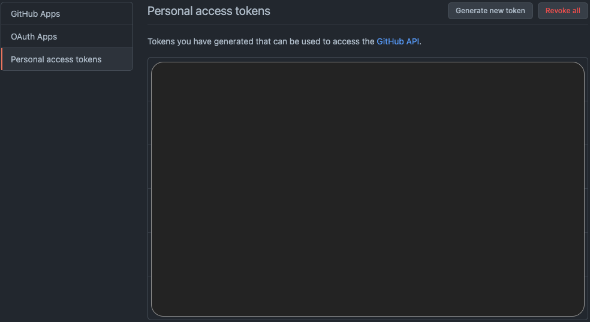
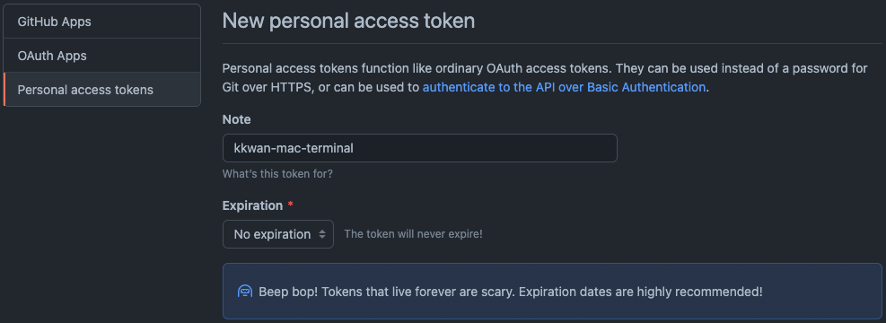

# **GitHub 인증을 위한 Access Token 생성**

> 2FA(Two-Factor Authentication)이 적용된 GitHub 계정의 경우 Terminal 로그인이 불가능하다. 이를 해결하기 위한 방법 중 하나인 Access Token을 기반으로 로그인하는 방법을 설명한다.

<br>

## **GitHub 로그인**

개인용 Access Token을 생성하기 위해 먼저 [**GitHub**](https://github.com/login)에 접속하여 로그인한다.

<br>

## **GitHub Access Token 생성 과정**

1. 정상적으로 로그인이 완료되었다면, Settings > Developer Settings > [**Personal Access Tokens**](https://github.com/settings/tokens)에 접근한다.

   

2. [**Generate new token**](https://github.com/settings/tokens/new) 클릭 후 GitHub 계정의 암호를 입력한다.

3. Note에 해당 Token을 식별할 수 있는 정보를 입력하고, 원하는 유효기간을 지정한다.

   

4. 요구하는 Scope을 체크하고, **"Generate token"** 버튼을 클릭한다.

<br>

## **일반적으로 사용하는 Token Scope**

- **repo**

  ```bash
  개인 리포지토리를 포함한 리포지토리에 대한 전체 액세스 권한을 부여합니다. 여기에는 코드에 대한 읽기/쓰기 액세스, 커밋 상태, 리포지토리 및 조직 프로젝트, 초대, 공동 작업자, 팀 구성원 추가, 배포 상태, 리포지토리 및 조직에 대한 리포지토리 웹훅이 포함됩니다. 또한 사용자 프로젝트를 관리할 수 있는 권한을 부여합니다.
  ```

- **gist**

  ```bash
  gist 대한 쓰기 액세스 권한을 부여합니다.
  ```

- **workflow**
  ```bash
  GitHub 작업 워크플로 파일을 추가 및 업데이트할 수 있는 권한을 부여합니다. 동일한 파일(경로와 내용이 모두 동일)이 동일한 저장소의 다른 분기에 있는 경우 이 범위 없이 워크플로 파일을 커밋할 수 있습니다. 워크플로 파일은 다른 범위 집합을 가질 수 있는 GITHUB_TOKEN을 노출할 수 있습니다.
  ```
