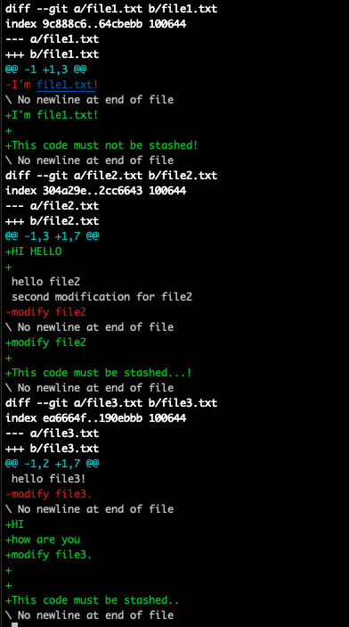
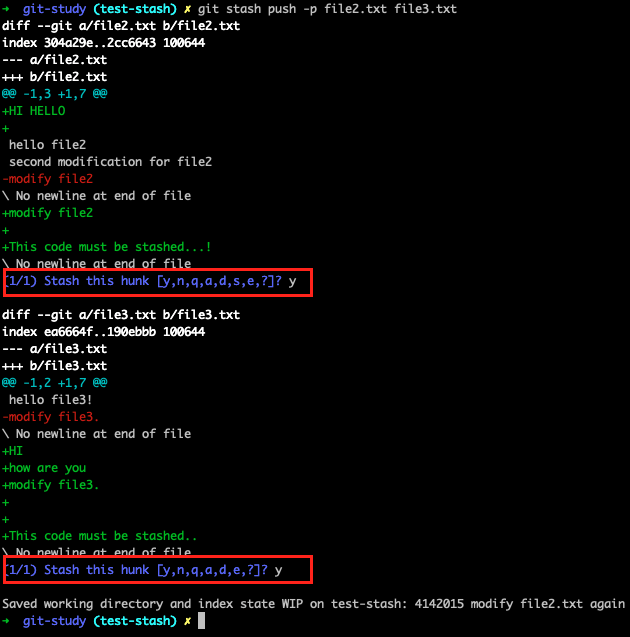
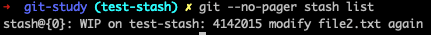

# 특정 파일만 stash

<br>

## 요약

특정 파일만 stash 하고 싶은 경우,

```bash
git stash push -p [file_name1] [file_name2] ...
```

<br>

## 예시

file1.txt, file2.txt, file3.txt 3개 파일 모두가 변경된 상황에서

file2.txt, file3.txt 2개 파일의 변경사항만 stash 하고 싶다면,

<details>

<summary>
git diff (file1.txt, file2.txt, file3.txt 3개 파일 모두가 변경된 상황)
</summary>



</details>

<br><br>

### 명령어 입력



<br><br>

### 결과 확인



<br><br>

# 참고

[Git Tools Interactive Staging](https://git-scm.com/book/en/v2/Git-Tools-Interactive-Staging)
