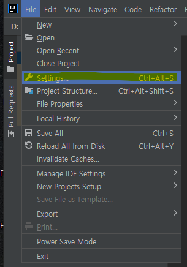
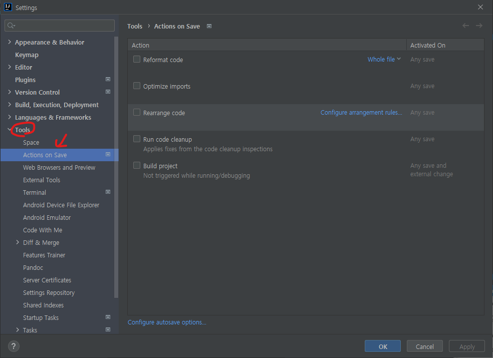

# Intellij IDEA - Action on Save

- Intellij IDEA 2021.2에서 추가된 기능
- 코드 리포멧팅, import 구문 최적화 등의 저장 시 실행할 수 있는 액션을 설정
  - 기존에 사용하던 `Save Action` 플러그인은 이제 보내줘도 될 것 같다

 

## 적용 방법

- Preferences 혹은 Settings - Tools - Action on Save 진입
- 원하는 옵션의 체크박스에 체크 후 Apply(or OK) 버튼 클릭

  

   

  