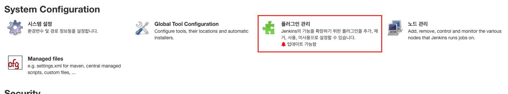
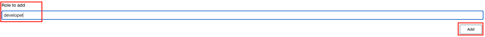

# 젠킨스 권한 관리 방법

 

## 1. 초기 세팅

 

### 1.1. 플러그인 설치

 

**1.1.1. 로그인 -> 좌측 사이드 메뉴 [Jenkins 관리] -> 플러그인 관리**

- 

  

  스크린 샷
  

  
  

  

- 상단 탭 목록에서 [설치된 플러그인 목록] 클릭
  - 검색바에서 "role" 검색 후 "Role-based Authorization Strategy" 플러그인 있으면 **다음 단계로**
    
  - 검색 결과에 해당 플러그인이 없으면 상단 [설치 가능] 탭 클릭 후 "role" 검색해서 체크박스에 체크 후 [재시작 없이 설치하기]
    

 

### 1.2. 초기 설정

 

**1.2.1. 권한 관리 기능 활성화 및 사용자 가입 허용**

[Jenkins 관리] -> [Confingure Global Security]

- Jenkins' own user database - [사용자의 가입 허용] 체크박스에 체크

  -> 권한 관리하려면 사용자들을 모두 추가해야하는데,, 관리자가 모두 추가하기엔 너무 많은 경우 공지를 통해 사용자들이 직접 회원가입할 수 있도록 가입 허용

- Role-Based Strategy 라디오 버튼 클릭
  - 역할 기반으로 권한 관리하는 기능 활성화

 

### 1.3. 권한 세팅

 

**1.3.1. 전역 역할(Global roles):** 젠킨스 전역에 대한 역할 관리
[Jenkins 관리] -> [Manage and Assign Roles] -> [Manage Roles]

1. [Role to add] 항목의 입력란에 추가할 역할명(developer) 입력 후 [Add] 버튼 클릭하여 추가
   
2. 테이블에 추가된 역할에 부여할 권한을 체크하고 스크롤 내려서 [Apply] 혹은 [Save] 버튼 클릭하면 저장됨

     

     

       주로 사용하는 권한 설명
     

       Overall - Read: 로그인 후 바로 보여지는 메인 화면에 대한 권한
       
       Job(작업)
       - Build: 작업 시작 권한
       - Cancel: 작업 중단 권한
       - Configure: 작업 설정 변경 권한
       - Create: 작업 생성 권한
       - Delete: 작업 제거 권한
       - Discover
         - 체크(활성화) 시 로그인 하지 않고 작업 URL로 접근하면 로그인 페이지로 리다이렉트
         - 활성화하지 않으면 로그인 하지 않고 접근 시 404 에러
       - Move: 작업 이동(젠킨스 내 폴더 이동) 권한
       - Read: 작업 조회 권한 (비활성화 시 로그인 후 해당 작업은 볼 수 없음)
       - ViewStatus: 활성화 시 "embeddable build status plugin"을 통해 빌드 상태를 볼 수 있음
       - Workspace: 시스템 내 젠킨스 워크스페이스에서 파일들에 접근할 수 있는 권한

     

   

 

**1.3.2. 아이템별 역할(Item roles):** 젠킨스 아이템별 역할 관리

[Jenkins] -> [Manage and Assign Roles] -> [Manages Roles]

1. [Role to add] 항목의 입력란에 추가할 역할명(backend_developer) 입력
2. [Pattern]에 해당 역할이 포함할 젠킨스 아이템(Job)의 이름 패턴을 입력(ex. Web.\* 입력 시 "Web"으로 시작하는 모든 젠킨스 아이템이 해당 역할에 포함됨)
3. [Add] 버튼 클릭하여 역할 추가
   
4. 테이블에 추가된 역할에 부여할 권한을 체크하고 스크롤 내려서 [Save] 혹은 [Apply] 버튼 클릭하면 저장됨
   

 

## 2. 권한 부여

### 2.1. 사용자 확인 및 권한 부여

 

**2.1.1. 사용자 확인**

[Jenkins 관리] -> [Manage Users]
사용자 리스트에서 권한을 부여할 User ID를 확인

 

**2.1.2. 권한 부여**

- Global roles, Item roles 부여 방법이 동일함
  [Jenkins 관리] -> [Manage and Assign Roles] -> [Assign Roles]

1. [User/group] 권한을 부여할 사용자의 User ID를 입력하고 [Add] 클릭하여 추가

   

2. 테이블에 추가된 사요앚에 부여할 권한을 가지고 역할에 체크

   

3. 스크롤 내려서 [Save] 혹은 [Apply] 클릭

   
