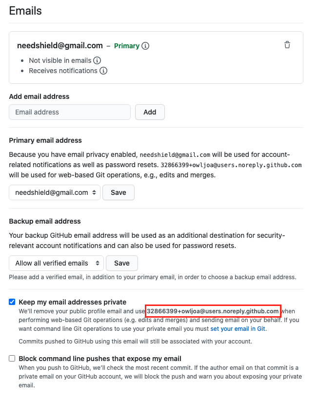

# 커밋에 공동 작성자(co-author)를 추가하는 방법

할당된 작업에 대해 다른 개발자에게 도움을 받았다면, 함께 기여했다는 사실을 명시하기 위해 커밋 작성 시 공동 작성자로 추가할 수 있다.

<br>

## 사전에 알아야할 것

- 공동 작성자의 이메일
- 공동 작성자의 이메일이 private 처리되어있는 경우, 프라이버시 보존을 위해 github이 제공하는 no-reply 메일 활용

  - no-reply 메일 확인방법: settings -> emails로 이동 후 아래 빨간박스 위치 확인

    

<br>

## 공동 작성자를 포함한 커밋 작성 방법

1. 커밋 메시지 작성
2. 커밋 메시지 아래로 빈라인 두개 추가
3. 빈라인 두개 아래에 다음과 같은 형태로 공동 작성자 정보 추가
   - Co-authored-by: author-name \<name@xxx.com\>
   ```bash
   # 공동 작성자가 한명인 경우
   git commit -m "commit with co-author
   dquote>
   dquote>
   dquote> Co-authored-by: owljoa <owljoa@mymail.com>"
   ```
   ```bash
   # 공동 작성자가 여러명인 경우
   git commit -m "commit with co-author
   dquote>
   dquote>
   dquote> Co-authored-by: owljoa <owljoa@mymail.com>
   dquote> Co-authored-by: needshield <needshield@mymail.com>"
   ```
4. 커밋 완료
