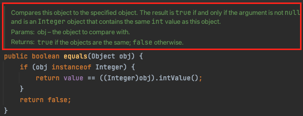
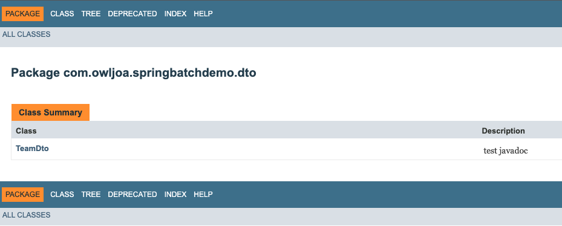

# Javadoc

- [1. 개념](#1-개념)
- [2. 주석 표현 방법](#2-주석-표현-방법)
- [3. javadoc 태그](#3-javadoc-태그)
- [4. 예시](#4-예시)
- [5. 문서 생성 방법](#5-문서-생성-방법)

<br><br>

## 1. 개념

- 소스코드 내에서 지정된 형태의 주석들을 HTML 형태의 API 문서를 생성하기 위해 자바 언어에서 제공하는 문서생성 도구다.
- 주로 HTML 웹 페이지 형태의 API 문서를 생성하는데에 많이 사용된다.

<br>

## 2. 주석 표현 방법

- /\*\* .... \*/ 형태로 표현해야 javadoc 주석으로 인식된다.

```java
// 한줄 주석

/*
* 여러 줄의 주석
*/

/**
* Javadoc 주석
*/
```

<br>

## 3. javadoc 태그

- @author: 작성자명
  ```java
  /**
  * ...
  * @author  Lee Boynton
  * @author  Arthur van Hoff
  * @author  Josh Bloch
  * @author  Joseph D. Darcy
  * ...
  */
  ```
- @param: 메소드 파라미터나 입력에 대한 설명
  ```java
  /**
  * ...
  * @param   obj   the object to compare with.
  * ...
  */
  ```
- @see: 다른 문서의 요소에 대한 링크

  ```java
  //해당 메소드 시그니처를 가진 메소드의 문서를 링크함

  /**
  * ...
  * @see #parseUnsignedInt(String, int)
  * @see #toUnsignedString(int, int)
  * ...
  */
  ```

- @version: 클래스, 인터페이스, enum의 버전에 대한 설명
  ```java
  /**
  * ...
  * @version $Id: RuntimeVisibleParameterAnnotations
  * ...
  */
  ```
- @return: 반환값에 대한 설명
  ```java
  /**
  * @return  {@code true} if the objects are the same;
  *          {@code false} otherwise.
  */
  ```

<br>

## 4. 예시

- `Integer` 클래스의 `equal` 메소드
- 작성하면 Intellij IDEA에서는 javadoc 주석에 대해 읽기모드와 쓰기모드를 제공하며 읽기모드에서는 주석이 문서형태로 표현된다.

  - 쓰기모드

    ```java
    /**
     * Compares this object to the specified object.  The result is
     * {@code true} if and only if the argument is not
     * {@code null} and is an {@code Integer} object that
     * contains the same {@code int} value as this object.
     *
     * @param   obj   the object to compare with.
     * @return  {@code true} if the objects are the same;
     *          {@code false} otherwise.
     */
    public boolean equals(Object obj) {
    	...
    }
    ```

  - 읽기 모드

    

<br>

## 5. 문서 생성 방법

- javadoc 명령 이용

  ```bash
  javadoc path/file_name
  javadoc path/package_name
  ```

- 예시

  1. javadoc 주석 작성

     ```java
     /**
      * test javadoc
      */
     public class TeamDto {
     	...
     }
     ```

  2. javadoc 명령 실행

     ```bash
     javadoc src/main/java/com/owljoa/springbatchdemo/dto/TeamDto.java

     Loading source file src/main/java/com/owljoa/springbatchdemo/dto/TeamDto.java...
     Constructing Javadoc information...
     Standard Doclet version 11.0.2
     Building tree for all the packages and classes...
     Generating ./com/owljoa/springbatchdemo/dto/TeamDto.html...
     Generating ./com/owljoa/springbatchdemo/dto/package-summary.html...
     Generating ./com/owljoa/springbatchdemo/dto/package-tree.html...
     Generating ./constant-values.html...
     Building index for all the packages and classes...
     Generating ./overview-tree.html...
     Generating ./index-all.html...
     Building index for all classes...
     Generating ./allclasses-index.html...
     Generating ./allpackages-index.html...
     Generating ./deprecated-list.html...
     Building index for all classes...
     Generating ./allclasses.html...
     Generating ./allclasses.html...
     Generating ./index.html...
     Generating ./help-doc.html...
     ```

  3. 생성된 문서 (index.html)

     
