# Kaggle Titanic Tutorial

<br>

## 1. 참여

- 문제별 경쟁에 참여하려면 competition page에 들어가야함
  - 타이타닉 문제 competition page: <https://www.kaggle.com/c/titanic/overview>

- 페이지 우측 상단의 "Join Oompetition" 버튼 클릭해서 참여
  - 캐글 계정이 없으면 가입부터 진행

<br>

## 2. 개요

<br>

### 2.1. 문제

- 타이타닉 승객 데이터를 이용해서 생존자/사망자 예측

<br>

### 2.2. 데이터

- 타이타닉 competition 페이지 내 데이터 탭에서 확인 가능
- 3개 파일: train.csv, test.csv, gender_submission.csv

<details>

<summary>
데이터 탭 스크린 샷
</summary>

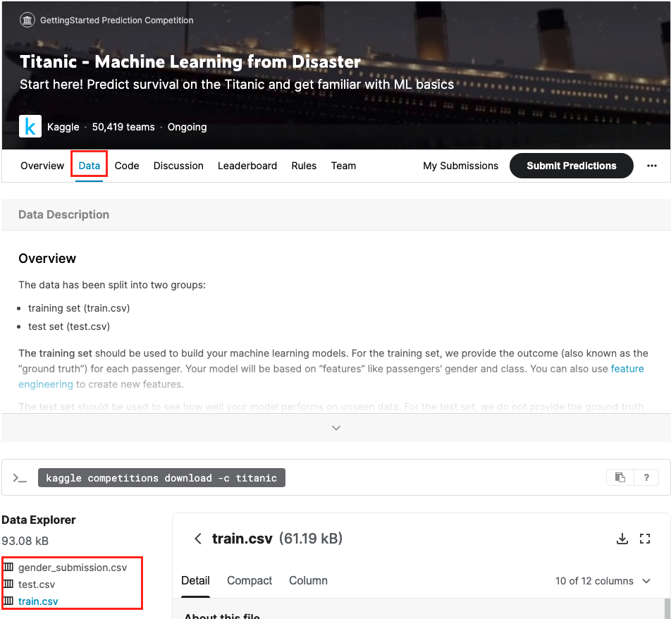

</details>

<br>

#### 2.2.1. train.csv

- 891명의 승객들에 대한 상세 데이터 셋 (전체 데이터의 일부)
  - 각 승객들에 대한 데이터가 테이블의 한 행을 차지
- 상세 데이터는 좌측의 파일명을 클릭해서 확인
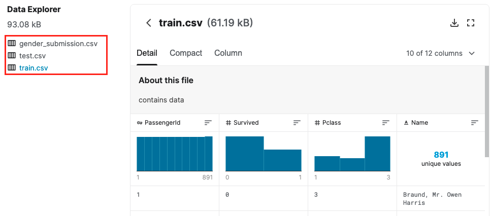

  - 두 번째 컬럼(Survived) 각 승객의 생사 여부를 판단
    - 1이면 생존
    - 0이면 사망
    - ex) 첫 번째 승객(Mr. Owen)은 타이타닉에서 사망했다.

<br>

#### 2.2.2. test.csv

- train.csv 파일에서 패턴을 찾아내면, 다른 418명의 승객의 생사 여부를 예측하는 것이 문제
- test.csv 파일에는 "Survived" 컬럼이 없음
  - test.csv 파일의 승객 데이터에 대해 생사 여부를 얼마나 잘 예측하는가에 따라 우리가 만든 모델의 점수가 부여됨

<br>

#### 2.2.3. gender_submission.csv

- 점수를 부여받기 위해 제출해야할 파일 형태 (예시 파일)
  - "PassengerId" 컬럼: test.csv 파일 내 각 승객의 ID
  - "Survived" 컬럼: 0이나 1값 (0: 사망, 1: 생존)
- 이 예시 파일의 내용을 보면 모든 여성은 생존, 남성은 사망했을 것으로 예측한 것을 확인할 수 있음

<br>

## 3. 코딩 환경

<br>

### 3.1. 캐글 노트북 (주피터 노트북과 유사) 만들기

- 로컬 환경(내 컴퓨터)에 아무것도 설치하지 않아도 작업할 수 있는 
- "Code" 탭 클릭 후 "New Notebook" 버튼 클릭
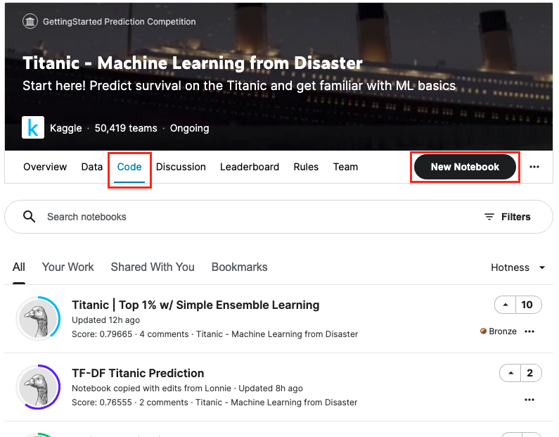

<br>

### 3.2. 노트북 이름은 변경 가능

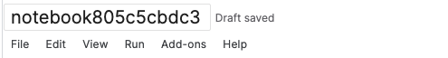
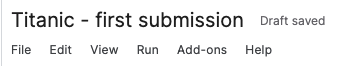

<br>

### 3.3. 코드 블록 (Code Cell)

- 코드를 블록별로 실행하는데 이 블록을 "code cell"이라고 지칭함
  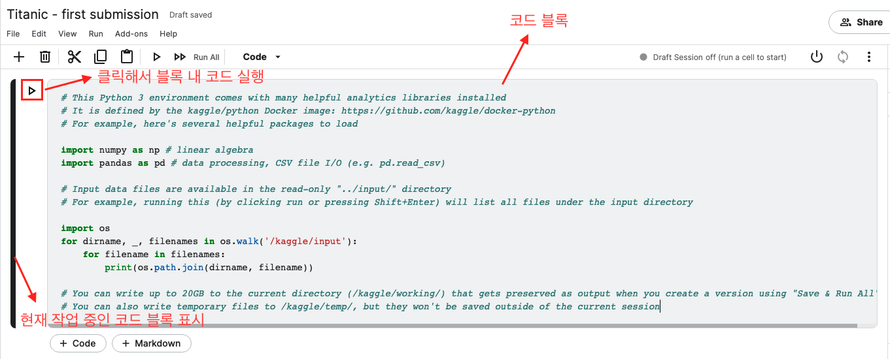
  - 현재 커서의 위치를 이용해서 작업중인 코드 블록이 좌측에 막대로 표시됨
  - 좌측 플레이 버튼이나 [Shift] + [Enter]로 현재 작업중인 코드 블록의 코드를 실행할 수 있음

<br>

- 미리 입력되어있는 코드는 캐글에서 노트북 환경에 준비해둔 입력 데이터 파일들(train.csv, test.csv, gender_submission.csv)를 확인시켜주는 코드
  - 실행 결과는 코드 블록 아래에 표시됨

    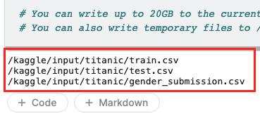

<br>

### 3.4. 데이터 불러오기

<br>

#### 3.4.1. 학습 데이터 불러오기

```python
# train.csv 파일에서 학습용 데이터 불러오기
train_data = pd.read_csv("/kaggle/input/titanic/train.csv")

# 처음 5개 데이터를 출력
train_data.head()
```

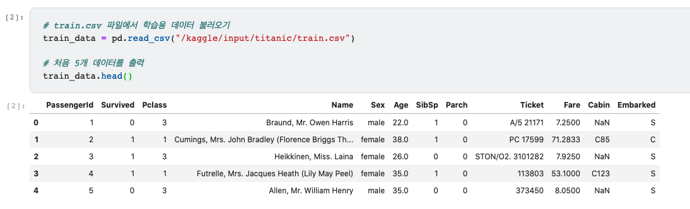

<br>

#### 3.4.2. 테스트 데이터 불러오기

```python
# test.csv 파일에서 테스트용 데이터 불러오기
test_data = pd.read_csv("/kaggle/input/titanic/test.csv")

# 처음 5개 데이터를 출력
test_data.head()
```

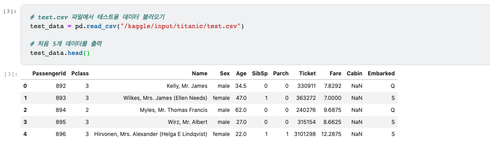

<br>

## 4. 첫 결과 제출 (submission)

<br>

### 4.1. 패턴 찾기

- gender_submission.csv 파일은 모든 여성이 생존하고 모든 남성이 사망했을 것으로 가정

  ```python
  # 학습 데이터에서 성별이 여성인 데이터 중 Survived 컬럼에 대한 데이터만 뽑아옴 (승객 ID 포함)
  women = train_data.loc[train_data.Sex == 'female']["Survived"]

  # 전체 여성 중 생존한 여성의 비율 => Survived 컬럼의 모든 값을 더해서 여성 데이터의 수로 나눔
  rate_women = sum(women)/len(women)

  print("% of women who survived:", rate_women)

  ######## 실행 결과 ########
  % of women who survived: 0.7420382165605095
  ```

  ```python
  # 학습 데이터에서 성별이 남성인 데이터 중 Survived 컬럼에 대한 데이터만 뽑아옴 (승객 ID 포함)
  men = train_data.loc[train_data.Sex == 'male']["Survived"]
  # 전체 남성 중 생존한 남성의 비율 => Survived 컬럼의 모든 값을 더해서 남성 데이터의 수로 나눔
  rate_men = sum(men)/len(men)

  print("% of men who survived:", rate_men)

  ######## 실행 결과 ########
  % of men who survived: 0.18890814558058924
  ```

  -> **타이타닉 승객들 중 여성은 75%가 생존했지만, 남성은 18%만이 생존하였음을 알 수 있음** <br>
  -> gender_submission.csv가 아주 안좋은 추측은 아닐 수 있다..

<br>

### 4.2. 학습 모델 만들기

- random forest 모델을 예로 만들 것
- 각 승객들의 데이터에 대해 다수의 트리 구조에서 나온 결과로 생사 여부에 대해 투표하여 해당 승객의 생존 여부를 예측

  ```python
  from sklearn.ensemble import RandomForestClassifier

  # 레이블
  y = train_data["Survived"]

  # 4개 feature에 대한 카테고리 데이터를 숫자로 표현해서 변수에 저장
  features = ["Pclass", "Sex", "SibSp", "Parch"]
  X = pd.get_dummies(train_data[features])
  X_test = pd.get_dummies(test_data[features])

  # 학습 데이터로 random forest 모델 내 트리 생성 
  model = RandomForestClassifier(n_estimators=100, max_depth=5, random_state=1)
  model.fit(X, y)

  # 학습된 모델로 테스트 데이터에 대한 예측 실행
  predictions = model.predict(X_test)

  # 결과물 저장용 데이터프레임 만들고 예측 결과(predictions)를 승객ID(PassengerId), 생존여부(Survivied) 컬럼의 형태로 저장
  # 제출 샘플로 올려져있던 gender_submission.csv의 형태와 맞게 
  output = pd.DataFrame({'PassengerId': test_data.PassengerId, 'Survived': predictions})
  # 데이터프레임을 csv 파일로 저장
  output.to_csv('my_submission.csv', index=False)
  print("Your submission was successfully saved!")
  ```

  - 4개의 컬럼(Pclass, Sex, SibSp, Parch)들에 대한 패턴을 찾는 모델
  - 학습 데이터를 기반으로 random forest 모델 내 트리들을 생성

<br>

### 4.3. 결과 제출

- 페이지 우측 상단 "Save Version" 버튼 클릭
  - Version Name 란에 원하는 버전명을 입력해도 되고, 안하면 자동으로 Version 1으로 부여됨
  - Save & Run All (Commit)이 설정되어있는지 꼭 확인할 것
    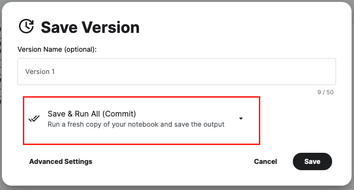
  - Save 버튼 클릭

<br>

- 우측 상단 "Save Version" 버튼 옆에 숫자가 0에서 1로 변경됨
  - 숫자 1로 변경된 버튼(Show versions)을 클릭  
    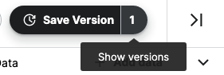
    <br><br>
  - 우측 상단 "Go to Viewer" 버튼 클릭
  - 우측 탭 메뉴에서 "Output" 클릭
  
    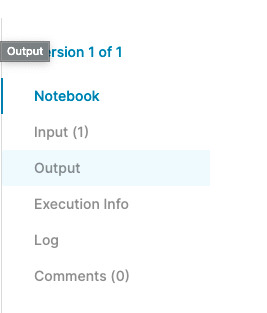
    <br><br>
  - 저장한 my_submission.csv 파일과 우측에 "Submit" 버튼이 보임
    - "Submit" 버튼 클릭
      - 노트북 이름, 노트북 버전, 결과 파일 확인
      - "Submit" 클릭하면 결과 제출 완료

<br>

## 참고

[Kaggle Titanic Tutorial](https://www.kaggle.com/alexisbcook/titanic-tutorial)