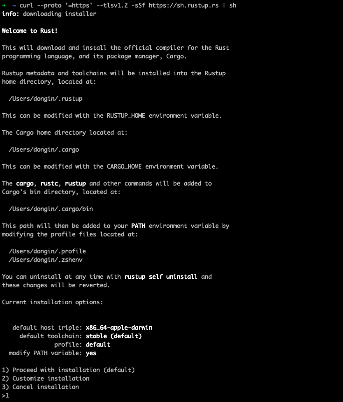
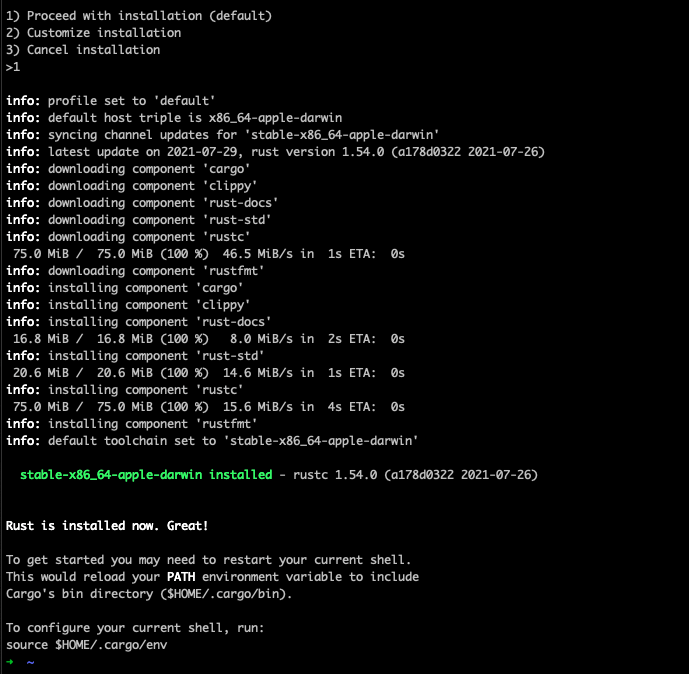

# Rust 설치 (macOS)

<br>

## 명령

- rustup: Rust 버전과 관련 도구들의 관리를 담당하는 CLI 도구

```bash
➜  ~ curl --proto '=https' --tlsv1.2 -sSf https://sh.rustup.rs | sh
```

<br>

## 설치 과정

### 1. 설치 명령 입력 후 추가 입력 요청에 1 입력

```bash
1) Proceed with installation (default)
2) Customize installation
3) Cancel installation
> 1
```

<details>
<summary>
명령 입력 후 추가 입력 요청 상황 스크린샷
</summary>



</details>

<br><br>

### 2. 설치 완료 확인

설치 완료 시 아래 문구가 출력됨

```bash
Rust is installed now. Great!
```

환경변수 적용을 위해 새로운 쉘 열고, 버전 확인

```bash
➜  ~ rustc --version
rustc 1.54.0 (a178d0322 2021-07-26)
```

<details>
<summary>
설치 완료 스크린샷
</summary>



</details>

<br><br>

# Rust 버전 업데이트 / 삭제

## 1. 버전 업데이트

```bash
➜  ~ rustup update
```

## 2. 삭제

```bash
➜  ~ rustup self uninstall
```

# 참고

[Rust Installation](https://doc.rust-lang.org/book/ch01-01-installation.html)
